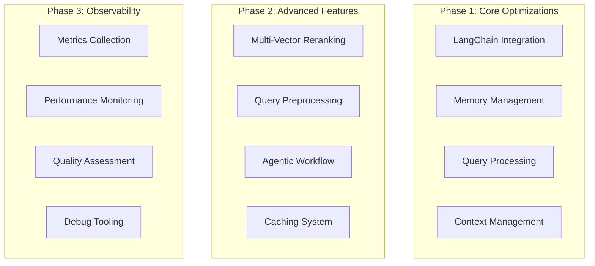

# LoreChat Enhancement Plan

This document outlines the planned enhancements for LoreChat to improve conversational quality, query processing, and overall system performance.

## Overview



## Phase 1: Core Optimizations

### LangChain Integration

We need to adapt our custom interfaces to work with LangChain's ecosystem:

```python
from langchain.llms.base import BaseLLM
from langchain.vectorstores.base import VectorStore
from langchain.embeddings.base import Embeddings

# LLM Adapter
class LangChainLLMAdapter(BaseLLM):
    def __init__(self, llm_service: BaseLLMService):
        self.llm_service = llm_service
        super().__init__()
    
    def _call(
        self,
        prompt: str,
        stop: Optional[List[str]] = None,
        **kwargs
    ) -> str:
        messages = [HumanMessage(content=prompt)]
        response = self.llm_service.generate_response(messages)
        return "".join(response)  # Convert generator to string

# Vector Store Adapter
class LangChainVectorStoreAdapter(VectorStore):
    def __init__(
        self,
        vector_service: BaseVectorStoreService,
        embedding_function: Embeddings
    ):
        self.vector_service = vector_service
        self.embedding_function = embedding_function
    
    def similarity_search(
        self,
        query: str,
        k: int = 4,
        **kwargs
    ) -> List[Document]:
        context = self.vector_service.get_relevant_context(query)
        return [Document(page_content=context)] if context else []
```

### Memory Management

Implement token-aware conversation memory that integrates with Streamlit's session state:

```python
class EnhancedMemoryManager:
    def __init__(
        self,
        llm_service: BaseLLMService,
        max_tokens: int = 1000
    ):
        self.llm_service = llm_service
        self.max_tokens = max_tokens
        self.token_estimator = TokenEstimator()
        
    def get_memory_context(
        self,
        messages: List[ChatMessage]
    ) -> str:
        """Extract relevant context from conversation history within token limit"""
        total_tokens = 0
        memory_messages = []
        
        # Process messages from newest to oldest
        for msg in reversed(messages):
            tokens = self.token_estimator.estimate(msg.content)
            if total_tokens + tokens <= self.max_tokens:
                memory_messages.insert(0, msg)
                total_tokens += tokens
            else:
                break
                
        return self.format_memory_context(memory_messages)
```

### Query Processing

Implement a query processing pipeline for complex queries:

```python
class QueryProcessor:
    def __init__(
        self,
        llm_service: BaseLLMService
    ):
        self.llm_service = llm_service
        
    async def process_query(
        self,
        query: str,
        history: List[ChatMessage]
    ) -> ProcessedQuery:
        # Analyze query complexity
        complexity = await self.analyze_complexity(query)
        
        if complexity > 0.7:  # Complex query threshold
            # Generate sub-queries for complex questions
            sub_queries = await self.generate_sub_queries(query)
            return ProcessedQuery(
                original=query,
                sub_queries=sub_queries,
                is_complex=True
            )
        else:
            # Simple query processing
            enhanced_query = await self.enhance_query(query)
            return ProcessedQuery(
                original=query,
                enhanced=enhanced_query,
                is_complex=False
            )
```

### Context Management

Implement smart context integration within token budget:

```python
class ContextManager:
    def __init__(
        self,
        max_tokens: int = 2000,
        cache_ttl: int = 300  # 5 minutes
    ):
        self.max_tokens = max_tokens
        self.context_cache = TTLCache(maxsize=100, ttl=cache_ttl)
        self.token_estimator = TokenEstimator()
        
    async def fetch_contexts(
        self,
        sub_queries: List[str],
        vector_store: BaseVectorStoreService
    ) -> List[str]:
        """Fetch contexts for multiple sub-queries in parallel"""
        async def fetch_single(query: str) -> str:
            cache_key = self._generate_cache_key(query)
            if cache_key in self.context_cache:
                return self.context_cache[cache_key]
            
            context = await vector_store.get_relevant_context(query)
            self.context_cache[cache_key] = context
            return context
        
        # Parallel execution of vector queries
        tasks = [fetch_single(q) for q in sub_queries]
        contexts = await asyncio.gather(*tasks)
        return contexts
        
    def integrate_contexts(
        self,
        contexts: List[str],
        memory_context: str
    ) -> str:
        """Smart context integration within token budget"""
        total_tokens = 0
        integrated_context = []
        
        # Allocate token budget
        vector_budget = int(self.max_tokens * 0.7)  # 70% for vector results
        memory_budget = int(self.max_tokens * 0.3)  # 30% for memory/history
        
        # Process vector store contexts
        for context in contexts:
            tokens = self.token_estimator.estimate(context)
            if total_tokens + tokens <= vector_budget:
                integrated_context.append(context)
                total_tokens += tokens
        
        # Add memory context within budget
        if memory_context:
            memory_tokens = self.token_estimator.estimate(memory_context)
            if total_tokens + memory_tokens <= self.max_tokens:
                integrated_context.append(memory_context)
        
        return "\n\n".join(integrated_context)
```

## Phase 2: Advanced Features

### Multi-Vector Reranking

Implement a reranking system using fast embedding models:

```python
class MultiVectorReranker:
    def __init__(
        self,
        fast_embeddings: Embeddings,  # e.g., all-MiniLM-L6-v2
        cross_encoder: PreTrainedModel  # e.g., cross-encoder/ms-marco-MiniLM-L-6-v2
    ):
        self.fast_embeddings = fast_embeddings
        self.cross_encoder = cross_encoder
        
    async def rerank(
        self,
        query: str,
        contexts: List[str],
        top_k: int = 3
    ) -> List[RankedContext]:
        # Initial fast ranking with cosine similarity
        query_embedding = await self.fast_embeddings.aembed_query(query)
        context_embeddings = await self.fast_embeddings.aembed_documents(contexts)
        
        # Calculate initial scores
        initial_scores = cosine_similarity(
            [query_embedding],
            context_embeddings
        )[0]
        
        # Get top candidates for cross-attention scoring
        top_candidates = sorted(
            zip(contexts, initial_scores),
            key=lambda x: x[1],
            reverse=True
        )[:top_k * 2]
        
        # Cross-attention reranking
        cross_scores = self.cross_encoder.predict([
            (query, context) for context, _ in top_candidates
        ])
        
        # Combine scores
        final_scores = [
            0.5 * initial + 0.5 * cross
            for (_, initial), cross in zip(top_candidates, cross_scores)
        ]
        
        return sorted(
            [
                RankedContext(context=ctx, score=score)
                for (ctx, _), score in zip(top_candidates, final_scores)
            ],
            key=lambda x: x.score,
            reverse=True
        )[:top_k]
```

### Query Preprocessing

Implement advanced query preprocessing techniques:

```python
class QueryPreprocessor:
    def __init__(
        self,
        llm: BaseLLM,
        embeddings: Embeddings
    ):
        self.llm = llm
        self.embeddings = embeddings
        
    async def process_query(self, query: str) -> EnhancedQuery:
        # Parallel processing of different enhancements
        results = await asyncio.gather(
            self.expand_query(query),
            self.generate_hypothetical_doc(query),
            self.analyze_query_intent(query)
        )
        
        expanded, hyde_doc, intent = results
        return EnhancedQuery(
            original=query,
            expanded=expanded,
            hyde_doc=hyde_doc,
            intent=intent
        )
    
    async def generate_hypothetical_doc(self, query: str) -> str:
        """Hypothetical Document Embedding (HyDE)"""
        prompt = f"""Write a detailed passage that would answer this question:
        Question: {query}
        Passage:"""
        return await self.llm.apredict(prompt)
        
    async def expand_query(self, query: str) -> str:
        """Expand query with additional terms"""
        prompt = f"""Rewrite the following query to include relevant keywords and synonyms:
        Query: {query}
        Expanded query:"""
        return await self.llm.apredict(prompt)
        
    async def analyze_query_intent(self, query: str) -> str:
        """Analyze query intent"""
        prompt = f"""Analyze the intent of this query:
        Query: {query}
        Intent:"""
        return await self.llm.apredict(prompt)
```

### Agentic Workflow

Implement a LangGraph-based workflow for complex queries:

```python
from langgraph.graph import Graph, StateGraph
from typing import Dict, TypedDict

class QueryState(TypedDict):
    query: str
    sub_queries: List[str]
    contexts: List[str]
    final_response: str
    
class ComplexQueryHandler:
    def __init__(
        self,
        llm_service: BaseLLMService,
        vector_store: BaseVectorStoreService,
    ):
        self.llm = llm_service
        self.vector_store = vector_store
        self.graph = self.create_processing_graph()
    
    def create_processing_graph(self) -> StateGraph:
        # Create graph with typed state
        graph = StateGraph(QueryState)
        
        # Add nodes
        graph.add_node("analyze", self.analyze_query)
        graph.add_node("generate_sub_queries", self.generate_sub_queries)
        graph.add_node("fetch_contexts", self.fetch_contexts)
        graph.add_node("synthesize", self.synthesize_response)
        
        # Define edges
        graph.add_edge("analyze", "generate_sub_queries")
        graph.add_edge("generate_sub_queries", "fetch_contexts")
        graph.add_edge("fetch_contexts", "synthesize")
        
        return graph.compile()
        
    async def analyze_query(self, state: QueryState) -> QueryState:
        """Analyze query complexity and type"""
        # Implementation
        return state
        
    async def generate_sub_queries(self, state: QueryState) -> QueryState:
        """Break down complex query into sub-queries"""
        # Implementation
        return state
        
    async def fetch_contexts(self, state: QueryState) -> QueryState:
        """Fetch contexts for all sub-queries"""
        # Implementation
        return state
        
    async def synthesize_response(self, state: QueryState) -> QueryState:
        """Synthesize final response from contexts"""
        # Implementation
        return state
```

### Caching System

Implement a multi-level caching system:

```python
class CachingSystem:
    def __init__(self):
        self.query_cache = TTLCache(maxsize=1000, ttl=300)  # 5-minute TTL
        self.embedding_cache = TTLCache(maxsize=1000, ttl=3600)  # 1-hour TTL
        self.response_cache = TTLCache(maxsize=500, ttl=300)  # 5-minute TTL
        
    def get_cached_response(self, query: str) -> Optional[str]:
        """Get cached response for exact query match"""
        cache_key = self._generate_cache_key(query)
        return self.response_cache.get(cache_key)
        
    def cache_response(self, query: str, response: str) -> None:
        """Cache response for a query"""
        cache_key = self._generate_cache_key(query)
        self.response_cache[cache_key] = response
        
    def get_cached_embedding(self, text: str) -> Optional[List[float]]:
        """Get cached embedding for text"""
        cache_key = self._generate_cache_key(text)
        return self.embedding_cache.get(cache_key)
        
    def cache_embedding(self, text: str, embedding: List[float]) -> None:
        """Cache embedding for text"""
        cache_key = self._generate_cache_key(text)
        self.embedding_cache[cache_key] = embedding
        
    def _generate_cache_key(self, text: str) -> str:
        """Generate cache key for text"""
        return hashlib.md5(text.encode()).hexdigest()
```

## Phase 3: Observability

### Metrics Collection

Implement comprehensive metrics collection:

```python
@dataclass
class QueryMetrics:
    query_time: float
    preprocessing_time: float
    retrieval_time: float
    reranking_time: float
    response_time: float
    token_usage: int
    context_chunks: int
    cache_hits: int
    
class MetricsCollector:
    def __init__(self):
        self.metrics_store = []
        
    def record_query_metrics(self, metrics: QueryMetrics) -> None:
        """Record metrics for a query"""
        self.metrics_store.append({
            "timestamp": datetime.now().isoformat(),
            **asdict(metrics)
        })
        
    def get_average_metrics(self, timeframe: str = "1h") -> Dict[str, float]:
        """Get average metrics for a timeframe"""
        # Implementation
        return {}
        
    def export_metrics(self, format: str = "json") -> str:
        """Export metrics in specified format"""
        # Implementation
        return ""
```

### Performance Monitoring

Implement performance monitoring:

```python
class PerformanceMonitor:
    def __init__(self):
        self.latency_tracker = LatencyTracker()
        self.resource_tracker = ResourceTracker()
        self.error_tracker = ErrorTracker()
        
    async def track_query_performance(
        self,
        query_func: Callable,
        *args,
        **kwargs
    ) -> Tuple[Any, PerformanceMetrics]:
        """Track performance of a query function"""
        start_time = time.time()
        start_resources = self.resource_tracker.get_current_usage()
        
        try:
            result = await query_func(*args, **kwargs)
            error = None
        except Exception as e:
            result = None
            error = e
            self.error_tracker.record_error(e)
            
        end_time = time.time()
        end_resources = self.resource_tracker.get_current_usage()
        
        metrics = PerformanceMetrics(
            latency=end_time - start_time,
            cpu_usage=end_resources.cpu - start_resources.cpu,
            memory_usage=end_resources.memory - start_resources.memory,
            error=error is not None
        )
        
        self.latency_tracker.record_latency(
            func_name=query_func.__name__,
            latency=metrics.latency
        )
        
        return result, metrics
```

### Quality Assessment

Implement quality assessment:

```python
class QualityAssessor:
    def __init__(self, llm: BaseLLM):
        self.llm = llm
        
    async def assess_response_quality(
        self,
        query: str,
        response: str,
        context: str
    ) -> QualityMetrics:
        """Assess quality of a response"""
        prompt = f"""
        Evaluate the quality of this response to a query.
        
        Query: {query}
        
        Context provided to the model:
        {context}
        
        Response:
        {response}
        
        Please rate on a scale of 1-10 for each metric:
        - Relevance: How relevant is the response to the query?
        - Completeness: How completely does it answer the query?
        - Accuracy: How factually accurate is the response given the context?
        - Coherence: How well-structured and coherent is the response?
        
        Format your response as JSON:
        {{
            "relevance": <score>,
            "completeness": <score>,
            "accuracy": <score>,
            "coherence": <score>,
            "explanation": "<brief explanation>"
        }}
        """
        
        result = await self.llm.apredict(prompt)
        try:
            parsed = json.loads(result)
            return QualityMetrics(
                relevance=parsed["relevance"],
                completeness=parsed["completeness"],
                accuracy=parsed["accuracy"],
                coherence=parsed["coherence"],
                explanation=parsed["explanation"]
            )
        except:
            # Fallback for parsing errors
            return QualityMetrics(
                relevance=0,
                completeness=0,
                accuracy=0,
                coherence=0,
                explanation="Failed to parse quality assessment"
            )
```

### Debug Tooling

Implement debug tooling:

```python
class RAGDebugger:
    def __init__(
        self,
        llm: BaseLLM,
        vector_store: BaseVectorStoreService
    ):
        self.llm = llm
        self.vector_store = vector_store
        
    def analyze_query_pipeline(
        self,
        query: str,
        trace: QueryTrace
    ) -> DebugReport:
        return DebugReport(
            query_analysis=self.analyze_query(query),
            context_quality=self.assess_context_quality(trace),
            performance_bottlenecks=self.find_bottlenecks(trace),
            optimization_suggestions=self.suggest_improvements(trace)
        )
        
    def visualize_query_trace(self, trace: QueryTrace) -> str:
        """Generate visualization of query trace"""
        # Implementation
        return ""
        
    def explain_context_selection(
        self,
        query: str,
        contexts: List[str],
        scores: List[float]
    ) -> str:
        """Explain why certain contexts were selected"""
        # Implementation
        return ""
```

## Implementation Strategy

### Phase 1: Foundation (Weeks 1-2)
- Implement LangChain adapters
- Set up basic observability
- Add memory management
- Integrate caching

### Phase 2: Advanced Features (Weeks 3-4)
- Add query preprocessing
- Implement multi-vector reranking
- Set up agentic workflow
- Enhance context management

### Phase 3: Optimization (Weeks 5-6)
- Implement comprehensive testing
- Add detailed metrics
- Set up monitoring dashboards
- Create debug tools

## Testing Strategy

### Unit Testing
- Test each component in isolation
- Mock dependencies
- Verify behavior with different inputs

### Integration Testing
- Test component interactions
- Verify end-to-end workflows
- Test with realistic data

### Performance Testing
- Measure latency under different loads
- Identify bottlenecks
- Optimize critical paths

### Quality Testing
- Compare response quality before and after enhancements
- Use automated quality metrics
- Conduct user satisfaction surveys

## Conclusion

This enhancement plan will significantly improve LoreChat's conversational quality, query processing capabilities, and overall system performance. By implementing these features in phases, we can ensure a smooth transition and validate improvements at each step.
