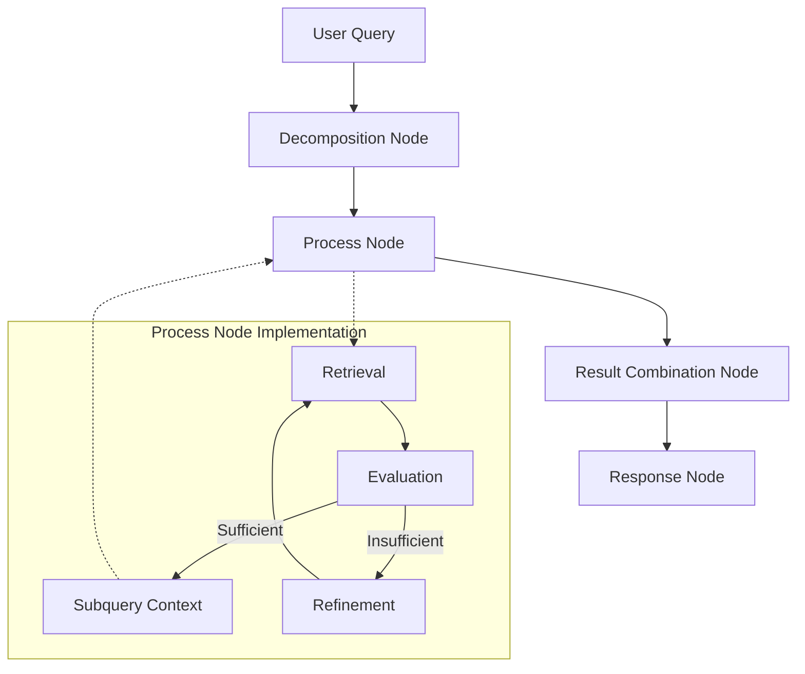
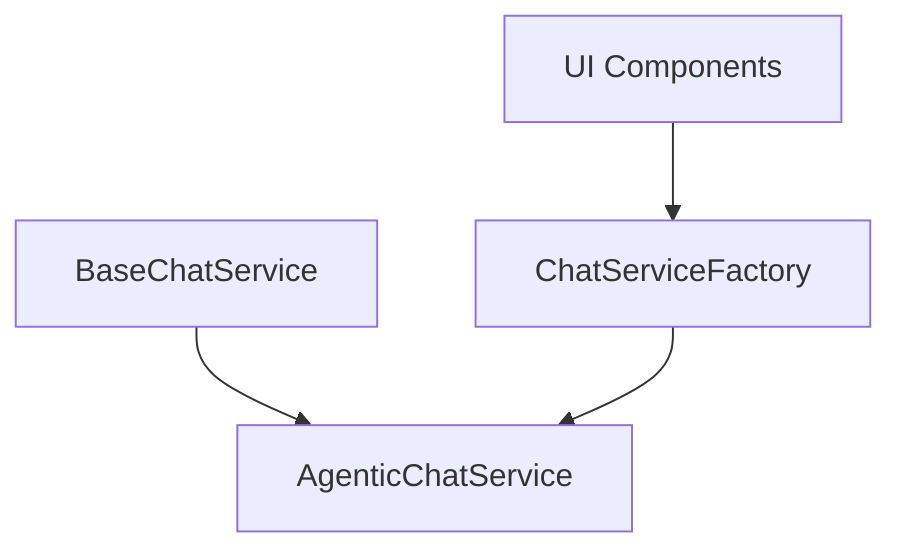

# Agentic Retrieval System Design

## Overview

This document outlines the design for enhancing LoreChat's retrieval system with agentic capabilities using a pure LangGraph approach. The goal is to create a more intelligent retrieval system that can:

1. Analyze and decompose complex queries
2. Select appropriate search methods based on query type
3. Evaluate search results for relevance
4. Refine queries when results are insufficient
5. Generate comprehensive responses using the most relevant context

## Architecture



## Design Philosophy

Our design follows these key principles:

1. **Unified Flow**: Treat all queries through the same pipeline, with simple queries as a special case of having one subquery
2. **Separation of Concerns**: Each node has a single, well-defined responsibility
3. **Explicit State Management**: State transitions are clearly defined in the graph structure
4. **Parallelism**: Process subqueries concurrently for efficiency
5. **Transparency**: The reasoning process is explicit and traceable across nodes
6. **Specialized LLMs**: Use appropriate LLMs for different tasks based on complexity and cost considerations

## Key Components

### 1. Enhanced State Management

```python
# app/chat/graph/enhanced_state.py
from typing import Any, Dict, List, Optional
from uuid import uuid4

from langchain.schema import Document
from langchain_core.messages import BaseMessage
from langgraph.graph import MessagesState
from pydantic import BaseModel, Field


class SubQuery(BaseModel):
    """
    Represents a single subquery with its processing state.
    
    This class tracks all information related to a subquery, including
    its text, retrieved documents, processing status, and results.
    """
    id: str = Field(default_factory=lambda: str(uuid4()))  # Unique identifier
    text: str  # The actual query text
    status: str = "pending"  # pending, processing, complete, failed
    retrieved_docs: List[Document] = Field(default_factory=list)
    refinement_count: int = 0
    result: str = ""
    sources: List[str] = Field(default_factory=list)  # Sources specific to this subquery


class EnhancedChatState(MessagesState):
    """
    Enhanced chat state with subquery tracking.
    
    This state object extends LangGraph's MessagesState to include additional
    fields needed for our agentic retrieval system.
    """
    messages: List[BaseMessage] = Field(default_factory=list)
    subqueries: List[SubQuery] = Field(default_factory=list)
    original_query: str = ""
    query_complexity: str = "simple"  # simple or complex
    combined_answer: Optional[str] = None
    thread_id: str = Field(default_factory=lambda: str(uuid4()))
```

### 2. Decomposition Node

```python
# app/chat/graph/decomposition_node.py
import json
from typing import Any, Dict, List, Tuple

from app import logger
from app.chat.graph.enhanced_state import EnhancedChatState, SubQuery
from app.services.llm import BaseLLMService
from langchain_core.messages import HumanMessage


class DecompositionNode:
    """
    Analyzes queries and breaks them down into appropriate subqueries.
    
    This node handles both simple and complex queries, determining complexity
    and creating either one subquery or multiple subqueries as needed.
    All in a single LLM call for efficiency.
    """
    
    def __init__(self, llm_service: BaseLLMService):
        """Initialize with LLM service."""
        logger.info("Initializing DecompositionNode")
        self.llm = llm_service.llm
        
    def __call__(self, state: EnhancedChatState) -> Dict[str, Any]:
        """
        Analyze and decompose query into subqueries.
        
        Args:
            state: Current graph state
            
        Returns:
            Updated state with subqueries
        """
        if not state["messages"]:
            return {"original_query": "", "query_complexity": "simple", "subqueries": []}
            
        # Get latest message
        latest_message = state["messages"][-1]
        if not isinstance(latest_message, HumanMessage):
            return {"original_query": "", "query_complexity": "simple", "subqueries": []}
            
        query = latest_message.content
        logger.info(f"Analyzing and decomposing query: {query}")
        
        # Analyze and decompose in a single LLM call
        complexity, subqueries = self._analyze_and_decompose(query)
        
        return {
            "original_query": query,
            "query_complexity": complexity,
            "subqueries": subqueries
        }
    
    def _analyze_and_decompose(self, query: str) -> Tuple[str, List[SubQuery]]:
        """
        Analyze query complexity and decompose into subqueries in a single LLM call.
        
        Args:
            query: The query to analyze and decompose
            
        Returns:
            Tuple of (complexity, list of SubQuery objects)
        """
        prompt = f"""
        Analyze and decompose this query: "{query}"
        
        First, determine if this is a simple, straightforward question or a complex question with multiple parts.
        Then, if it's complex, break it down into 2-5 simpler subqueries that together would answer the original question.
        If it's simple, just use the original query as the only subquery.
        
        Output your analysis and decomposition as JSON:
        {{
          "query_type": "simple" or "complex",
          "reasoning": "brief explanation of your decision",
          "subqueries": [
            "first subquery",
            "second subquery",
            ...
          ]
        }}
        
        For simple queries, the subqueries array should contain just one element: the original query.
        For complex queries, the subqueries array should contain 2-5 elements that break down the original query.
        """
        
        try:
            response = self.llm.invoke(prompt)
            result = json.loads(response)
            
            query_type = result.get("query_type", "simple")
            subquery_texts = result.get("subqueries", [query])
            
            # Ensure we have at least one subquery
            if not subquery_texts:
                logger.warning("No subqueries returned, falling back to original query")
                subquery_texts = [query]
                
            # Create SubQuery objects
            subqueries = [
                SubQuery(
                    text=sq_text,
                    status="pending"
                )
                for sq_text in subquery_texts
            ]
            
            logger.info(f"Query analysis: {query_type} with {len(subqueries)} subqueries")
            return query_type, subqueries
            
        except Exception as e:
            logger.error(f"Error analyzing and decomposing query: {str(e)}", exc_info=True)
            # Fall back to treating as simple query
            return "simple", [SubQuery(text=query, status="pending")]
```

### 3. Processing Node

```python
# app/chat/graph/processing_node.py
import asyncio
import json
from typing import Any, Dict, List

from app import logger
from app.chat.graph.enhanced_state import EnhancedChatState, SubQuery
from app.services.llm import BaseLLMService
from app.services.vectorstore import BaseVectorStoreService
from langchain.schema import Document


class ProcessingNode:
    """
    Processes all subqueries in parallel.
    
    This node handles the retrieval, evaluation, and refinement steps
    for each subquery concurrently using asyncio for better concurrency
    management and thread safety.
    """
    
    def __init__(
        self, 
        vector_store: BaseVectorStoreService, 
        retrieval_llm_service: BaseLLMService,
        evaluation_llm_service: BaseLLMService = None,
        refinement_llm_service: BaseLLMService = None,
        answer_llm_service: BaseLLMService = None
    ):
        """
        Initialize with vector store and LLM services.
        
        Args:
            vector_store: Vector store for document retrieval
            retrieval_llm_service: Primary LLM service
            evaluation_llm_service: LLM service for evaluation (optional)
            refinement_llm_service: LLM service for query refinement (optional)
            answer_llm_service: LLM service for answer generation (optional)
        """
        logger.info("Initializing ProcessingNode")
        self.vector_store = vector_store
        self.retrieval_llm = retrieval_llm_service
        
        # Use provided LLMs or fall back to the primary LLM
        self.evaluation_llm = evaluation_llm_service or retrieval_llm_service
        self.refinement_llm = refinement_llm_service or retrieval_llm_service
        self.answer_llm = answer_llm_service or retrieval_llm_service
        
    async def __call__(self, state: EnhancedChatState) -> Dict[str, Any]:
        """
        Process all subqueries in parallel using asyncio.
        
        Args:
            state: Current graph state
            
        Returns:
            Updated state with processed subqueries
        """
        subqueries = state.get("subqueries", [])
        if not subqueries:
            logger.warning("No subqueries to process")
            return {"subqueries": []}
            
        logger.info(f"Processing {len(subqueries)} subqueries in parallel")
        
        # Process all subqueries in parallel using asyncio
        tasks = [self._process_subquery(sq) for sq in subqueries]
        results_list = await asyncio.gather(*tasks, return_exceptions=True)
        
        # Update subqueries with results
        updated_subqueries = []
        for sq, result in zip(subqueries, results_list):
            if isinstance(result, Exception):
                # Handle exceptions
                logger.error(f"Error processing subquery: {str(result)}", exc_info=True)
                sq.status = "failed"
                sq.result = f"Error: {str(result)}"
            else:
                # Update with successful result
                sq.status = "complete"
                sq.retrieved_docs = result.get("retrieved_docs", [])
                sq.refinement_count = result.get("refinement_count", 0)
                sq.result = result.get("answer", "No answer found")
                sq.sources = result.get("sources", [])
                
            updated_subqueries.append(sq)
        
        return {"subqueries": updated_subqueries}
    
    async def _process_subquery(self, subquery: SubQuery) -> Dict[str, Any]:
        """
        Process a single subquery through retrieval, evaluation, and refinement.
        
        Args:
            subquery: The subquery to process
            
        Returns:
            Dictionary with processing results
        """
        logger.info(f"Processing subquery: {subquery.text}")
        
        try:
            # Initial retrieval
            docs = await self._retrieve_documents(subquery.text)
            
            # Evaluate if documents are sufficient
            evaluation = await self._evaluate_results(subquery.text, docs)
            
            # Refine if needed (only once to avoid loops)
            refinement_count = 0
            if not evaluation["sufficient"] and refinement_count < 1:
                # Refine query
                refined_query = await self._refine_query(subquery.text, docs)
                refinement_count += 1
                
                # Retry with refined query
                docs = await self._retrieve_documents(refined_query)
            
            # Generate answer
            answer = await self._generate_answer(subquery.text, docs)
            
            # Extract sources
            sources = []
            for doc in docs:
                if doc.metadata and doc.metadata.get("source"):
                    sources.append(doc.metadata["source"])
                elif doc.metadata and doc.metadata.get("url"):
                    sources.append(doc.metadata["url"])
            
            result = {
                "retrieved_docs": docs,
                "refinement_count": refinement_count,
                "answer": answer,
                "sources": list(set(sources))  # Remove duplicates
            }
            
            return result
            
        except Exception as e:
            logger.error(f"Error processing subquery: {str(e)}", exc_info=True)
            raise
    
    async def _retrieve_documents(self, query: str) -> List[Document]:
        """
        Retrieve relevant documents for a query.
        
        Args:
            query: The query to search for
            
        Returns:
            List of retrieved documents
        """
        logger.info(f"Retrieving documents for: {query}")
        try:
            # Use the vector store's retriever
            docs = self.vector_store.as_retriever().invoke(query)
            logger.info(f"Retrieved {len(docs)} documents")
            return docs
        except Exception as e:
            logger.error(f"Error retrieving documents: {str(e)}", exc_info=True)
            return []
    
    async def _evaluate_results(self, query: str, docs: List[Document]) -> Dict[str, Any]:
        """
        Evaluate if retrieved documents are sufficient to answer the query.
        
        Args:
            query: The original query
            docs: Retrieved documents
            
        Returns:
            Evaluation result with sufficient flag and reasoning
        """
        if not docs:
            logger.info("No documents retrieved, marking as insufficient")
            return {"sufficient": False, "reasoning": "No documents retrieved"}
        
        # Format context from retrieved docs
        context = "\n\n".join(
            f"Document {i+1}:\n{doc.page_content}" 
            for i, doc in enumerate(docs)
        )
        
        # Create prompt for evaluation
        prompt = f"""
        Evaluate if the following documents contain sufficient information to answer the query.
        
        Query: {query}
        
        Documents:
        {context}
        
        Output your evaluation as JSON:
        {{
          "sufficient": true or false,
          "reasoning": "explanation of your decision",
          "missing_information": "description of what information is missing (if insufficient)"
        }}
        """
        
        try:
            # Use the evaluation LLM
            response = self.evaluation_llm.invoke(prompt)
            result = json.loads(response.content if hasattr(response, 'content') else response)
            
            sufficient = result.get("sufficient", False)
            reasoning = result.get("reasoning", "")
            
            logger.info(f"Document evaluation: sufficient={sufficient}, reasoning={reasoning}")
            
            return {
                "sufficient": sufficient,
                "reasoning": reasoning,
                "missing_information": result.get("missing_information", "")
            }
        except Exception as e:
            logger.error(f"Error evaluating results: {str(e)}", exc_info=True)
            # Default to insufficient if evaluation fails
            return {"sufficient": False, "reasoning": f"Evaluation error: {str(e)}"}
    
    async def _refine_query(self, query: str, docs: List[Document]) -> str:
        """
        Refine query based on retrieved documents.
        
        Args:
            query: The original query
            docs: Retrieved documents that were insufficient
            
        Returns:
            Refined query
        """
        logger.info(f"Refining query: {query}")
        
        # Format context from retrieved docs
        context = "\n\n".join(
            f"Document {i+1}:\n{doc.page_content}" 
            for i, doc in enumerate(docs)
        )
        
        # Create prompt for query refinement
        prompt = f"""
        The following query needs to be refined because the retrieved documents don't contain sufficient information to answer it.
        
        Original query: "{query}"
        
        Retrieved documents:
        {context}
        
        Please create a refined version of the query that might retrieve more relevant information.
        Focus on clarifying ambiguities, adding specific keywords, or reformulating the question.
        
        Output only the refined query text, without any explanations or additional formatting.
        """
        
        try:
            # Use the refinement LLM
            response = self.refinement_llm.invoke(prompt)
            refined_query = response.content if hasattr(response, 'content') else str(response)
            
            # Clean up the response
            refined_query = refined_query.strip().strip('"')
            
            logger.info(f"Refined query: {refined_query}")
            return refined_query
        except Exception as e:
            logger.error(f"Error refining query: {str(e)}", exc_info=True)
            # Fall back to original query with a marker
            return f"{query} (refinement failed)"
    
    async def _generate_answer(self, query: str, docs: List[Document]) -> str:
        """
        Generate answer for a query using retrieved documents.
        
        Args:
            query: The query to answer
            docs: Retrieved documents to use as context
            
        Returns:
            Generated answer
        """
        logger.info(f"Generating answer for: {query}")
        
        if not docs:
            return "I couldn't find any relevant information to answer your question."
            
        # Format context from retrieved docs
        context = "\n\n".join(
            f"Document {i+1}:\n{doc.page_content}" 
            for i, doc in enumerate(docs)
        )
        
        # Create prompt for answer generation
        prompt = f"""
        Answer the following question using only the provided context. If the context doesn't contain
        relevant information to answer the question, say "I don't have enough information to answer this question."
        
        Question: {query}
        
        Context:
        {context}
        
        Provide a comprehensive, accurate answer based solely on the information in the context.
        Do not include information that isn't supported by the context.
        If different documents contain conflicting information, acknowledge this in your answer.
        
        Answer:
        """
        
        # Generate answer
        try:
            # Use the answer LLM
            response = self.answer_llm.invoke(prompt)
            answer = response.content if hasattr(response, 'content') else str(response)
            return answer.strip()
        except Exception as e:
            logger.error(f"Error generating answer: {str(e)}", exc_info=True)
            return "An error occurred while generating the answer."
```

### 4. Result Combination Node

```python
# app/chat/graph/combination_node.py
from typing import Any, Dict

from app import logger
from app.chat.graph.enhanced_state import EnhancedChatState
from app.services.llm import BaseLLMService


class CombinationNode:
    """
    Combines results from multiple subqueries.
    
    For simple queries (one subquery), this node passes through the result.
    For complex queries, it combines the results into a coherent answer.
    """
    
    def __init__(self, llm_service: BaseLLMService):
        """Initialize with LLM service."""
        logger.info("Initializing CombinationNode")
        self.llm = llm_service.llm
        
    def __call__(self, state: EnhancedChatState) -> Dict[str, Any]:
        """
        Combine subquery results if needed.
        
        Args:
            state: Current graph state
            
        Returns:
            Updated state with combined answer
        """
        original_query = state.get("original_query", "")
        subqueries = state.get("subqueries", [])
        
        if not subqueries:
            logger.warning("No subqueries to combine")
            return {"combined_answer": "No results available."}
        
        # For simple queries (just one subquery), no combination needed
        if len(subqueries) == 1:
            logger.info("Single subquery, passing through result")
            return {"combined_answer": subqueries[0].result}
        
        # For complex queries, combine results
        logger.info("Combining results from {} subqueries".format(len(subqueries)))
        
        # Format subquery results for the prompt
        subquery_results = []
        for i, sq in enumerate(subqueries, 1):
            subquery_results.append(f"Subquery {i}: {sq.text}\nAnswer: {sq.result}")
        
        # Combine results
        subquery_text = "\n\n".join(subquery_results)
        prompt = f"""
        Combine the following subquery results into a coherent answer to the original question.
        
        ORIGINAL QUESTION: "{original_query}"
        
        SUBQUERY RESULTS:
        {subquery_text}
        
        Provide a comprehensive answer that addresses all aspects of the original question.
        Ensure the answer is well-structured, coherent, and flows naturally.
        If there are contradictions between subquery results, acknowledge them in your answer.
        If some subqueries failed to provide useful information, focus on the successful ones.
        
        Your combined answer:
        """
        
        try:
            combined_answer = self.llm.invoke(prompt)
            result = combined_answer.content if hasattr(combined_answer, 'content') else str(combined_answer)
            logger.info("Successfully combined subquery results")
            return {"combined_answer": result.strip()}
        except Exception as e:
            logger.error("Error combining results: {}".format(str(e)), exc_info=True)
            # Fall back to concatenating results
            fallback = "I found multiple pieces of information:\n\n" + "\n\n".join(subquery_results)
            return {"combined_answer": fallback}
```

### 5. Response Node

```python
# app/chat/graph/response_node.py
from typing import Any, Dict, List

from app import logger
from app.chat.graph.enhanced_state import EnhancedChatState
from app.services.llm import BaseLLMService
from app.services.prompts import BasePrompt
from langchain_core.messages import AIMessage


class ResponseNode:
    """
    Formats the final response using LLM and user prompt.
    
    This node uses the user's prompt template and the LLM to generate
    a properly formatted response with appropriate attribution.
    """
    
    def __init__(self, llm_service: BaseLLMService, prompt_template: BasePrompt):
        """
        Initialize with LLM service and prompt template.
        
        Args:
            llm_service: LLM service for response generation
            prompt_template: Prompt template for formatting
        """
        logger.info("Initializing ResponseNode")
        self.llm_service = llm_service
        self.prompt_template = prompt_template
        
    def __call__(self, state: EnhancedChatState) -> Dict[str, Any]:
        """
        Generate response using LLM and prompt template.
        
        Args:
            state: Current graph state
            
        Returns:
            Updated state with response message
        """
        original_query = state.get("original_query", "")
        subqueries = state.get("subqueries", [])
        combined_answer = state.get("combined_answer", "")
        
        if not combined_answer:
            logger.warning("No combined answer available")
            combined_answer = "I don't have enough information to answer that question."
        
        # Format context with subquery information
        context_parts = []
        
        # For simple queries (just one subquery)
        if len(subqueries) == 1:
            sq = subqueries[0]
            context = "Answer: {}".format(sq.result)
            if sq.sources:
                context += "\nSources: {}".format(", ".join(sq.sources))
            context_parts.append(context)
        else:
            # For complex queries, include the combined answer and subquery details
            context_parts.append("Combined Answer: {}".format(combined_answer))
            
            # Then add details for each subquery
            for i, sq in enumerate(subqueries, 1):
                part = "Subquery {}: {}\nAnswer: {}".format(i, sq.text, sq.result)
                if sq.sources:
                    part += "\nSources: {}".format(", ".join(sq.sources))
                context_parts.append(part)
        
        # Join all context parts
        full_context = "\n\n".join(context_parts)
        
        # Use prompt template to format messages for LLM
        formatted_messages = self.prompt_template.format_messages(
            chat_history=state["messages"][:-1],  # Exclude the latest user message
            context=full_context,
            input=original_query
        )
        
        # Generate response using LLM
        try:
            response = self.llm_service.invoke(formatted_messages)
            
            # Add response to messages
            messages = state["messages"].copy()
            messages.append(AIMessage(content=response.content))
            
            logger.info("Generated final response")
            return {"messages": messages}
        except Exception as e:
            logger.error("Error generating response: {}".format(str(e)), exc_info=True)
            
            # Fall back to combined answer
            messages = state["messages"].copy()
            messages.append(AIMessage(content=combined_answer))
            
            return {"messages": messages}
```

## LLM Configuration System

```python
# app/services/llm/llm_config.py
from enum import Enum
from typing import Dict, Optional

from app import logger
from app.services.llm import BaseLLMService, LLMFactory, LLMProvider


class NodeType(str, Enum):
    """Types of nodes in the workflow."""
    DECOMPOSITION = "decomposition"
    PROCESSING = "processing"
    EVALUATION = "evaluation"
    REFINEMENT = "refinement"
    ANSWER = "answer"
    COMBINATION = "combination"
    RESPONSE = "response"


class LLMConfiguration:
    """
    Configuration for LLMs used in different nodes.
    
    This class maps node types to appropriate LLM models based on
    the requirements of each node. This allows us to use smaller,
    faster models for simple tasks and more powerful models for
    complex reasoning.
    """
    
    # Default configuration mapping node types to provider/model
    DEFAULT_CONFIG: Dict[NodeType, Optional[Dict[str, str]]] = {
        NodeType.DECOMPOSITION: {"provider": LLMProvider.Anthropic, "model": "claude-3-sonnet-20240229"},
        NodeType.PROCESSING: {"provider": LLMProvider.OpenAI, "model": "gpt-4o"},
        NodeType.EVALUATION: {"provider": LLMProvider.Anthropic, "model": "claude-3-haiku-20240307"},
        NodeType.REFINEMENT: {"provider": LLMProvider.Anthropic, "model": "claude-3-sonnet-20240229"},
        NodeType.ANSWER: {"provider": LLMProvider.OpenAI, "model": "gpt-4o"},
        NodeType.COMBINATION: {"provider": LLMProvider.Anthropic, "model": "claude-3-sonnet-20240229"},
        NodeType.RESPONSE: None  # Use user-selected model
    }
    
    @classmethod
    def get_llm_service(cls, node_type: NodeType, user_llm_service: BaseLLMService) -> BaseLLMService:
        """
        Get the appropriate LLM service for a node type.
        
        Args:
            node_type: Type of node requiring an LLM
            user_llm_service: User-selected LLM service
            
        Returns:
            LLM service configured for the node
        """
        # If this node should use the user-selected LLM, return it
        if cls.DEFAULT_CONFIG[node_type] is None:
            logger.info(f"Using user-selected LLM for {node_type}")
            return user_llm_service
            
        # Otherwise, create a new LLM service based on configuration
        config = cls.DEFAULT_CONFIG[node_type]
        logger.info(f"Creating LLM service for {node_type}: {config['provider']}/{config['model']}")
        
        try:
            return LLMFactory.create_llm_service(
                provider=config["provider"],
                model_name=config["model"]
            )
        except Exception as e:
            logger.error(f"Error creating LLM service for {node_type}: {str(e)}", exc_info=True)
            # Fall back to user-selected LLM
            logger.info(f"Falling back to user-selected LLM for {node_type}")
            return user_llm_service
```

## Service Architecture

We've implemented a service architecture that follows the interface segregation principle:



### Base Service Interface

```python
# app/chat/base_service.py
from abc import ABC, abstractmethod
from typing import Generator, List, Optional

from app.services.prompts import PersonaType
from pydantic import BaseModel


class ChatMessage(BaseModel):
    """Chat message model."""
    role: str
    content: str


class BaseChatService(ABC):
    """
    Abstract base class for chat services.
    
    This defines the interface that all chat service implementations must follow.
    It provides a common API for chat interactions regardless of the underlying
    implementation details.
    """
    
    @abstractmethod
    def process_message(
        self,
        query: str,
        history: Optional[List[ChatMessage]] = None,
        thread_id: Optional[str] = None
    ) -> Generator:
        """
        Process a message and return a streaming response.
        
        Args:
            query: Current user query
            history: Optional chat history
            thread_id: Optional thread ID for conversation tracking
        
        Returns:
            Generator for streaming response
        """
        pass
        
    @abstractmethod
    def change_persona(self, persona_type: PersonaType) -> None:
        """
        Change the chat persona.
        
        Args:
            persona_type: New persona type to use
        """
        pass
```

### Factory Pattern

```python
# app/chat/service.py
from app import logger
from app.chat.agentic_service import AgenticChatService
from app.chat.base_service import BaseChatService
from app.services.llm import BaseLLMService
from app.services.prompts import PersonaType
from app.services.vectorstore import VectorStoreFactory


class ChatServiceFactory:
    """
    Factory for creating chat service instances.
    
    This factory abstracts the creation of chat services and handles
    dependencies like vector stores internally.
    """
    
    @staticmethod
    def create_chat_service(
        llm_service: BaseLLMService,
        persona_type: PersonaType = PersonaType.SCRIBE
    ) -> BaseChatService:
        """
        Create a chat service instance.
        
        Args:
            llm_service: LLM service for response generation
            persona_type: Type of chat persona to use
            
        Returns:
            A chat service implementation
        """
        logger.info(f"Creating chat service with persona: {persona_type}")
        
        # Get vector store internally
        vector_store
