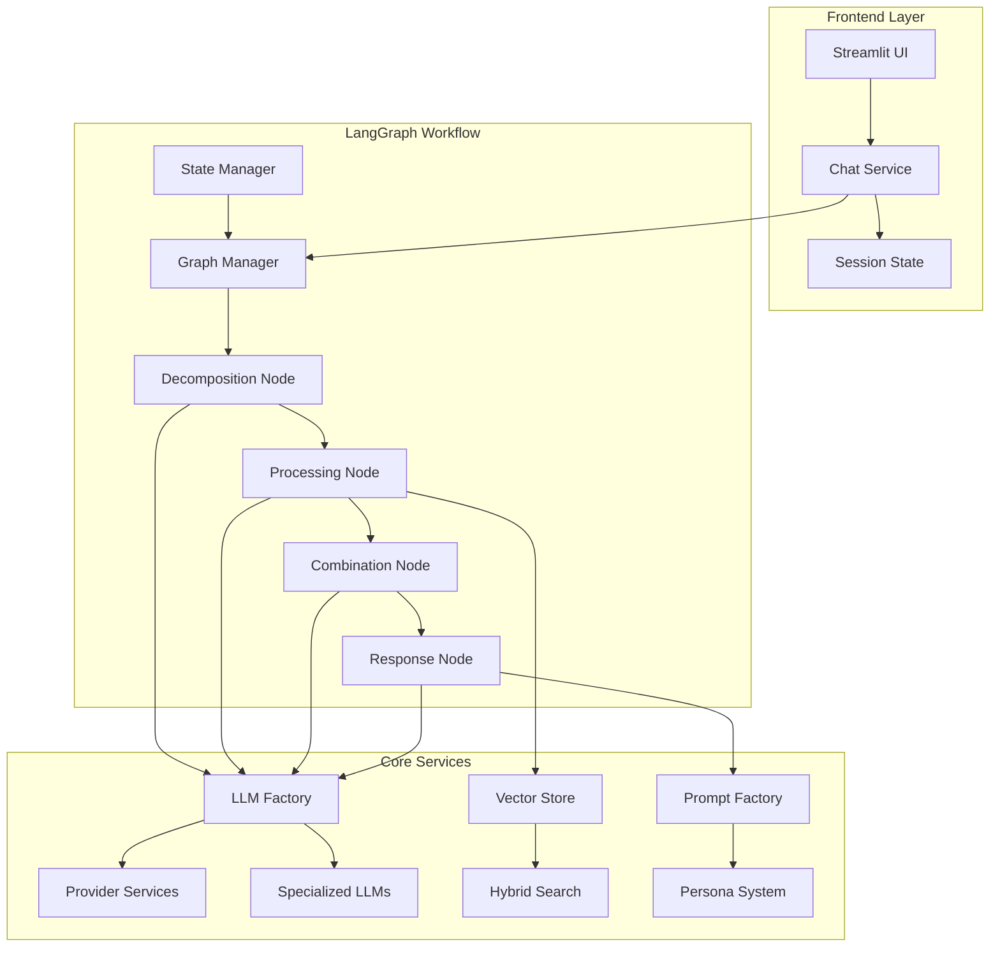
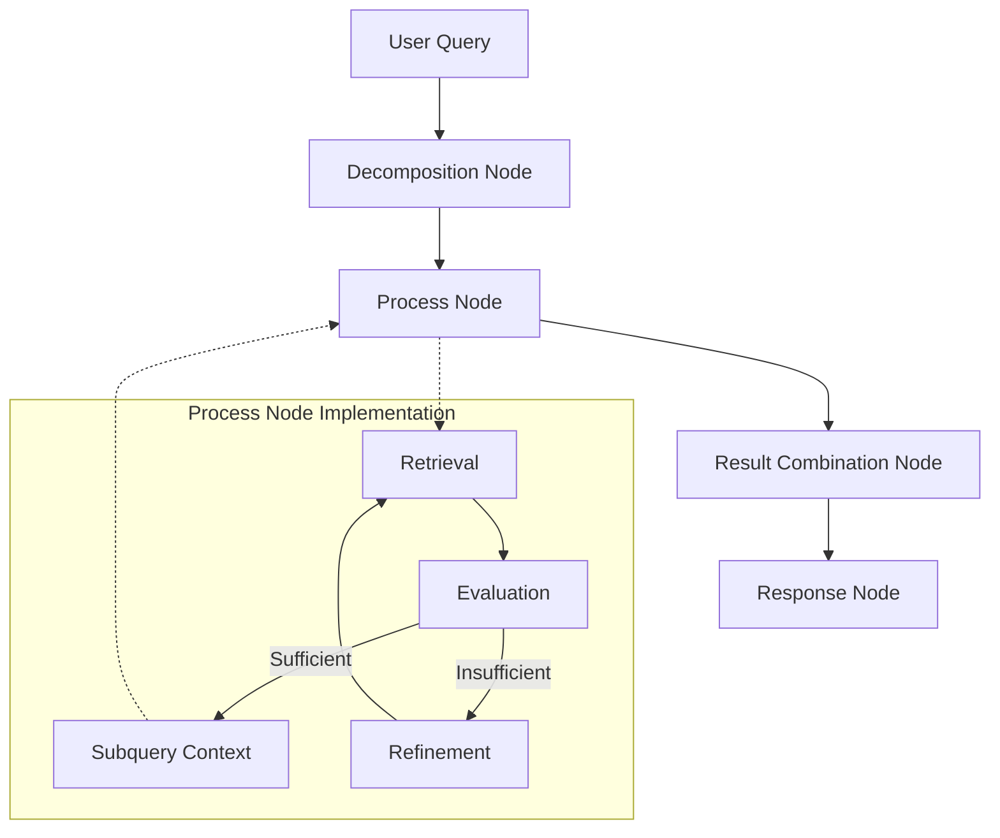
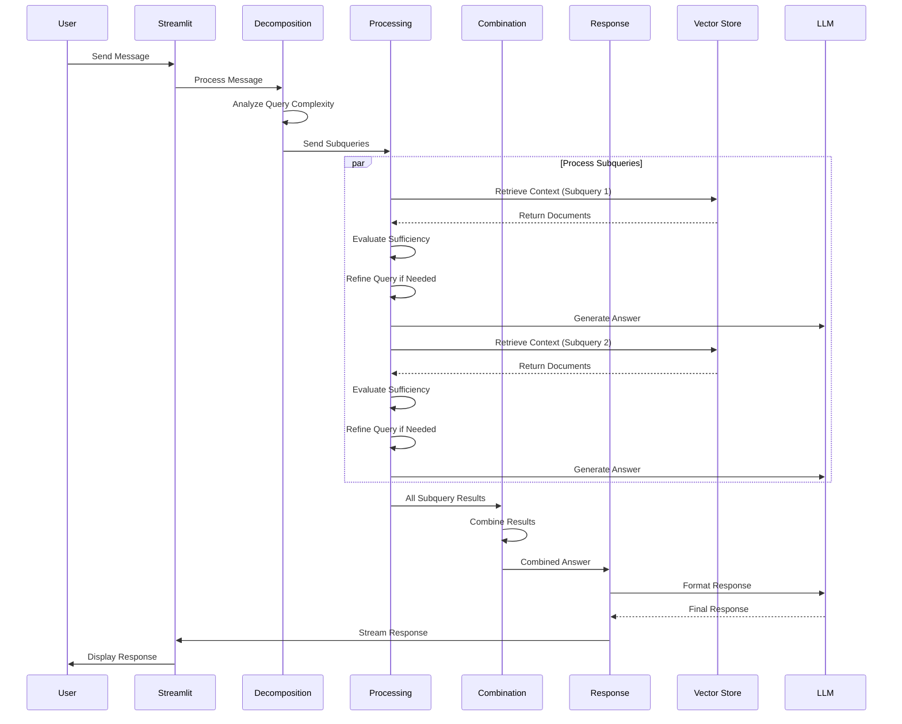
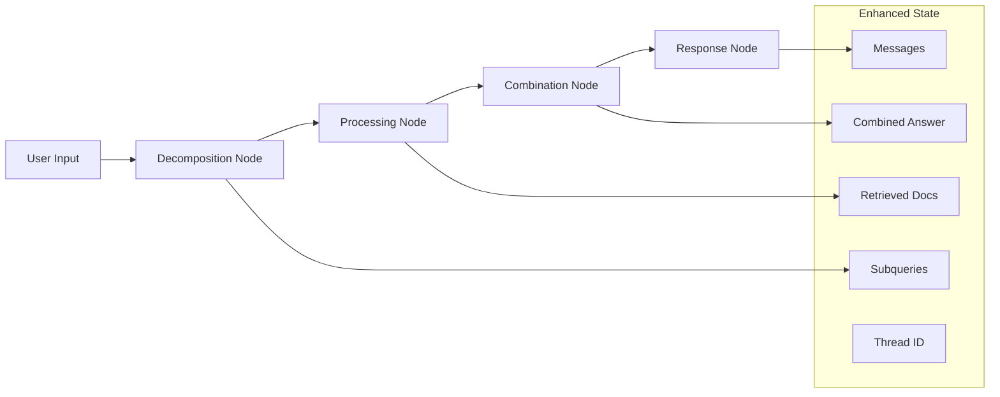
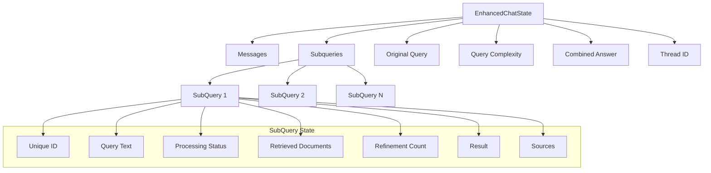
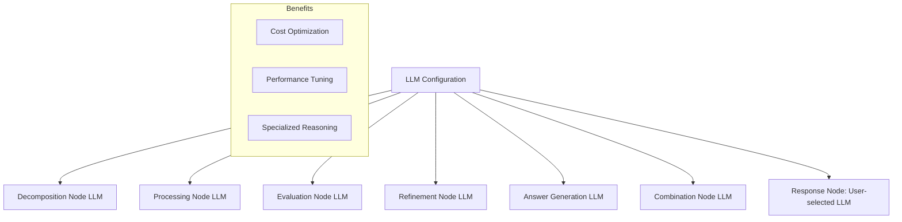
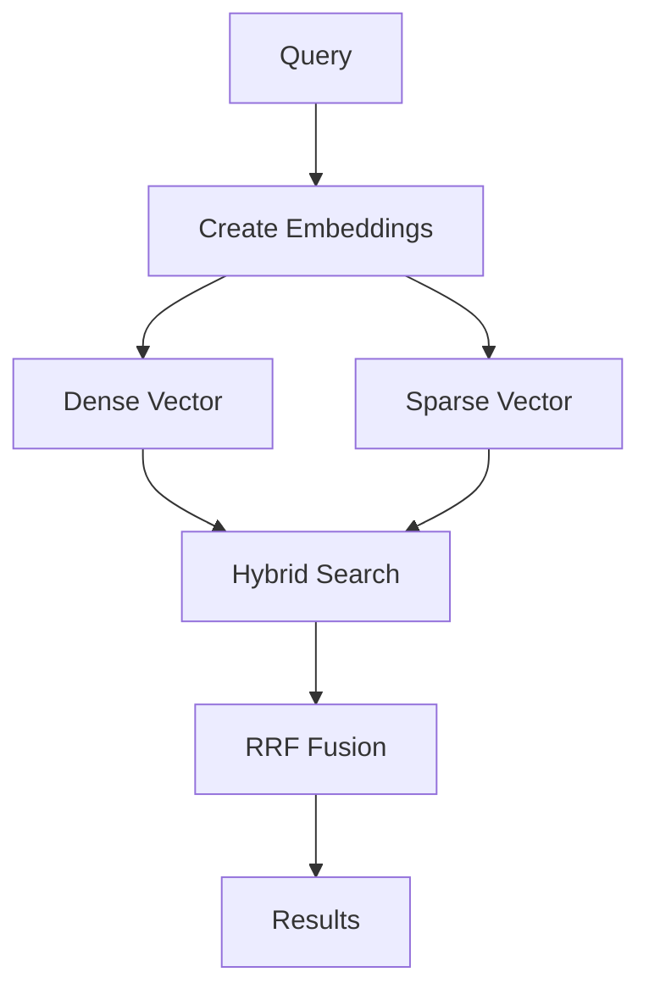
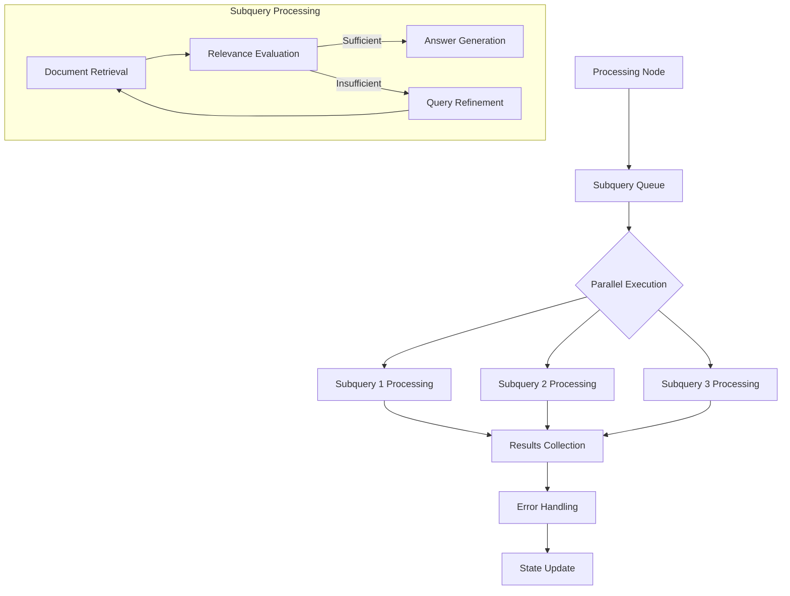
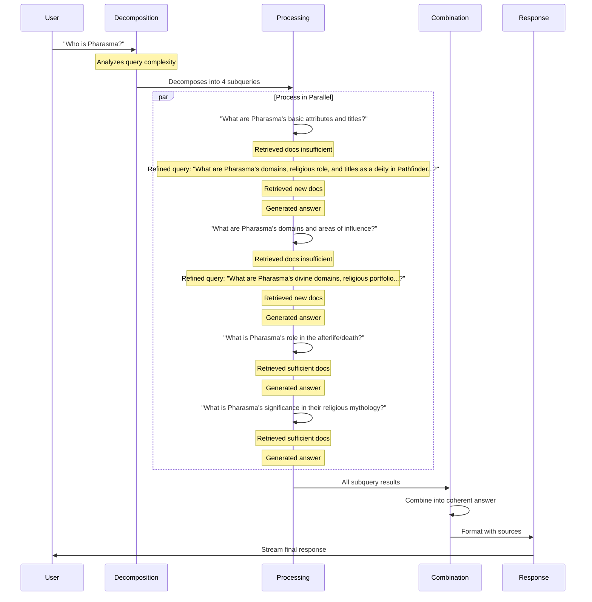

# LoreChat 🤖

A modern AI chat platform that makes website content come alive through conversation.

> 📚 For development guides, see [DEVELOPMENT.md](DEVELOPMENT.md)

## Project Overview 🚀

Welcome to LoreChat! This is my GenAI portfolio project to demonstrate graph-based AI conversations with advanced agentic capabilities.

What makes it special? LoreChat uses LangGraph to create smart, flowing conversations about website content. Think of it as your website's friendly AI guide that can break down complex questions, research multiple aspects in parallel, and deliver comprehensive answers.

Why LangGraph? I wanted to get more familiar with modern AI frameworks like LangGraph and LangChain. The graph-based approach enables sophisticated agentic workflows that traditional chain-based systems struggle to implement elegantly.

How does it work? The magic happens through:
- Intelligent query decomposition and parallel processing 🧩
- Hybrid vector search for relevant content 🔍
- Natural conversations using specialized LLMs for different tasks 💭
- Clear source tracking, so you can see the original content for yourself 📝

LoreChat works with [LoreChatCDK](https://github.com/laialex501/lorechat-cdk) to run smoothly in the cloud.

### Key Features ⚡

Smart Conversations:
- Agentic graph-based chat flows with query decomposition 🧠
- Parallel processing of complex queries 🚀
- Intelligent result combination for coherent responses 🔄
- Chat history and memory management with thread persistence 📋
- Source tracking in responses with attribution 📚
- Dynamic LLM swapping at runtime 🔀
- Dynamic chat persona swapping at runtime 👤
- Specialized LLM selection for different reasoning tasks 🎯

Tech Choices:
- Works with OpenAI GPT, Anthropic Claude, Deepseek, and Amazon Nova 🤖
- Local testing with FAISS 🔬
- Serverless vector store with Upstash Vector ☁️
- Containerizable with either Docker or Finch for cloud deployments 🔌
- Full system monitoring 📊

### Tech Stack 🛠️

Core Tools:
- Python 3.9 🐍
- Streamlit 📱
- LangChain & LangGraph 🔗
- FAISS & Upstash Vector 🔍

Support Tools:
- AWS SDK ☁️
- Docker/Finch 🐋
- pytest 🧪

## System Architecture 🏗️

Let's look at how LoreChat works. I designed it to be clear and organized:

### Agentic Workflow Architecture 🧩

The agentic workflow follows a carefully designed flow that enables sophisticated query handling:

### Message Lifecycle 🔄

Here's what happens when you chat with the agentic system:

## Core Parts 🔧

### 1. Agentic LangGraph Implementation 🧠

The agentic system uses a sophisticated graph structure with specialized nodes:

The graph consists of four main nodes:
1. **Decomposition Node**: Analyzes query complexity and breaks it down into subqueries 🧩
2. **Processing Node**: Handles retrieval, evaluation, and refinement for each subquery in parallel ⚡
3. **Combination Node**: Merges results from multiple subqueries into a coherent answer 🔄
4. **Response Node**: Formats the final response with source attribution 📝

Why this works well:
- Handles complex queries through decomposition 🧠
- Processes multiple aspects in parallel for efficiency ⚡
- Combines results intelligently for comprehensive answers 📊
- Maintains clear state transitions and error handling 🛡️
- Enables specialized LLM selection for different tasks 🎯

### 2. Enhanced State Management 📊

The agentic system uses an enhanced state model that extends LangGraph's base state:

This enhanced state architecture:
- Tracks each subquery's processing status (pending, processing, complete, failed) 📋
- Maintains document retrieval results for context preservation 📚
- Records query refinement attempts for optimization 🔄
- Preserves source attribution for transparency 🔍
- Enables comprehensive error handling across the workflow 🛡️
- Supports thread-based persistence for session management 🧵

### 3. Specialized LLM Configuration 🎯

The system uses different LLMs for different tasks based on their strengths:

This specialized configuration:
- Matches LLM capabilities to task requirements 🎯
- Optimizes for cost and performance ⚡
- Uses smaller models for simpler tasks 💰
- Reserves powerful models for complex reasoning 🧠
- Falls back gracefully when needed 🛡️

### 4. Vector Store Architecture 🔍

I implemented a hybrid search approach using Upstash Vector:

The hybrid search combines:
- Dense vectors for semantic similarity 🧮
- Sparse vectors for keyword matching 🔤
- Reciprocal Rank Fusion (RRF) for result combination 🔀

This helps find the most relevant information every time.

### 5. Parallel Processing Architecture ⚡

The processing node handles multiple subqueries concurrently using an asynchronous architecture:

This parallel architecture:
- Dramatically reduces response time for complex queries ⚡
- Processes all subqueries simultaneously with asyncio
- Handles errors gracefully for individual subqueries 🛡️
- Maintains thread safety with proper concurrency management 🔒
- Scales efficiently with query complexity 📈
- Preserves state consistency across parallel operations 🔄

## Deep Dive: Agentic Flow Example 🔬

Let's walk through a real example of the agentic system in action, processing the query "Who is Pharasma?":

### Step-by-Step Breakdown:

1. **Decomposition Phase**:
   - The system analyzed "Who is Pharasma?" and determined it was a complex query
   - It decomposed the query into 4 subqueries covering different aspects:
     - Basic attributes and titles
     - Domains and areas of influence
     - Role in afterlife/death
     - Religious significance

2. **Parallel Processing Phase**:
   - All 4 subqueries were processed concurrently
   - For 2 subqueries, the initial document retrieval was insufficient
   - The system automatically refined these queries to be more specific
   - Each subquery generated its own answer with source attribution

3. **Combination Phase**:
   - The system combined the 4 subquery results into a coherent answer
   - It ensured the final response addressed all aspects of the original query
   - It maintained proper flow and eliminated redundancies

4. **Response Phase**:
   - The final answer was formatted according to the user's selected persona
   - The response was streamed back to the user with source attribution
   - The entire process took approximately 5 seconds

This example demonstrates how the agentic system handles complex queries more effectively than traditional approaches by breaking them down, processing aspects in parallel, and intelligently combining the results.

## Pending Tasks 🚧

While the core agentic system is operational, several enhancements are in development:

### 1. Streaming Optimization 🌊
- Implement token-by-token streaming across all nodes
- Reduce initial response latency with progressive generation
- Add real-time typing indicators for more natural conversation flow

### 2. Latency Reduction ⚡
- Optimize LLM prompt templates for faster responses
- Implement predictive retrieval for common query patterns
- Add caching layer for frequently accessed documents
- Explore batched processing for related subqueries

### 3. LangSmith Integration 📊
- Add comprehensive tracing for all LLM calls
- Implement detailed performance metrics for each node
- Enable A/B testing of different prompt strategies
- Create visualization dashboards for system performance

### 4. LLM Evaluation Framework 🧪
- Develop automated evaluation for response quality
- Implement comparative testing between different models
- Create benchmarks for various query types
- Build feedback loop for continuous improvement

### 5. Mode Selection 🔍
- Add "Deep Research" mode for comprehensive analysis
- Implement "Standard" mode for faster, simpler responses
- Create user preference settings for mode selection
- Develop automatic mode selection based on query complexity

## Making Things Fast ⚡

1. **Parallel Processing**
   - Concurrent subquery handling with asyncio ⚡
   - Specialized LLMs for different reasoning tasks 🎯
   - Efficient error handling and recovery 🛡️

2. **Hybrid Search**
   - Sparse vector creation with threshold filtering 🔍
   - Reciprocal Rank Fusion for result combination 🔀
   - Metadata-enhanced retrieval 📝

3. **Response Streaming**
   - Chunked response delivery 🌊
   - Progressive UI updates 📱
   - Efficient memory use 💾

4. **State Management**
   - Enhanced state with subquery tracking 📊
   - Selective state persistence 💾
   - Efficient checkpointing ✅
   - Memory-aware cleanup 🧹

## Future Plans 🔮

While the current agentic system is robust, I'm considering several enhancements:

1. **Advanced Agentic Features**
   - Multi-hop reasoning for complex queries 🧠
   - Dynamic subquery generation based on initial results 🔄
   - Self-correction mechanisms for improved accuracy ✅
   - Cross-reference verification between subqueries 🔍

2. **Vector Store Optimizations**
   - Vector store caching for frequent queries 💾
   - Progressive indexing for large document sets 🚀
   - Automatic reindexing based on content changes 🔄
   - Semantic clustering for improved retrieval 🧩

3. **UI Enhancements**
   - Real-time typing indicators ⌨️
   - Visualization of the agentic workflow 📊
   - Interactive source exploration 🔍
   - Query suggestion system 💡

4. **System Updates**
   - Distributed state management for high availability 🤝
   - Enhanced error recovery across all nodes 🛡️
   - Advanced monitoring with LangSmith integration 📈
   - Multi-modal support for images and other content types 🖼️

## License 📜

This project is licensed under the MIT License. This means you are free to use, modify, and distribute the software, subject to the terms and conditions of the MIT License. For more details, please see the LICENSE file in the project repository.
