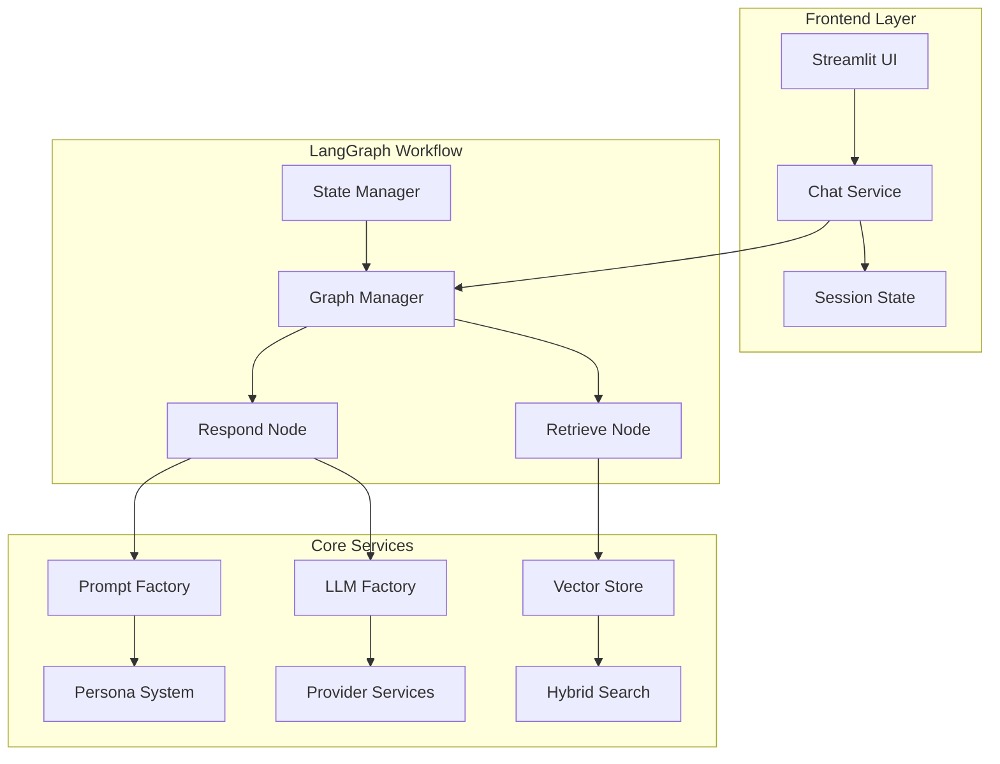
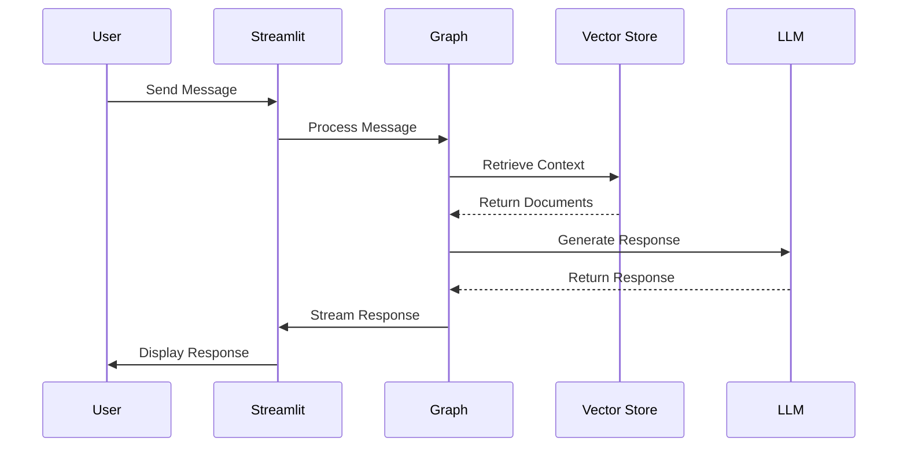
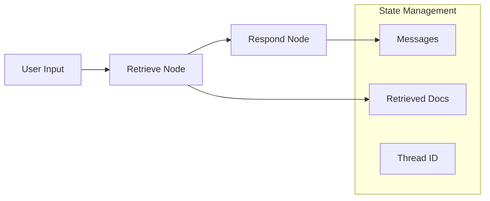
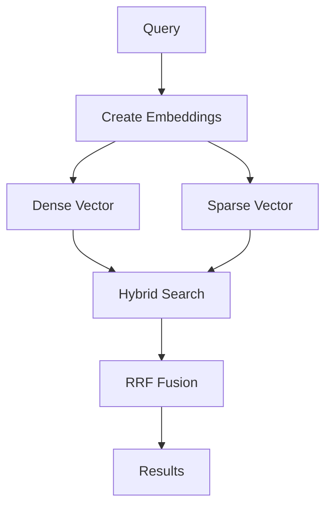
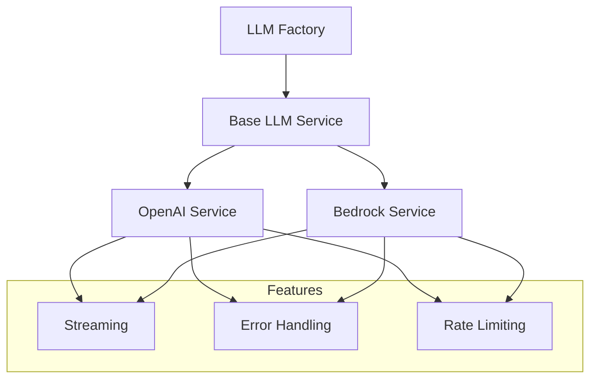

# LoreChat 🤖

A modern AI chat platform that makes website content come alive through conversation.

> 📚 For development guides, see [DEVELOPMENT.md](DEVELOPMENT.md)

## Project Overview 🚀

Welcome to LoreChat! This is my GenAI portfolio project to demonstrate graph-based AI conversations. 

What makes it special? LoreChat uses LangGraph to create smart, flowing conversations about your website content. Think of it as your website's friendly AI guide.

Why LangGraph? I found that traditional chat systems can get messy with complex conversations. LangGraph keeps things clean and organized. It's like having a well-designed roadmap for each chat.

Want to see how it works? LoreChat aims to handle about 50 users at once, with a quick response time. The magic happens through:
- Smart context finding 🔍
- Natural conversations 💭
- Clear source tracking 📝

LoreChat works with [LoreChatCDK](https://github.com/laialex501/lorechat-cdk) to run smoothly in the cloud.

### Key Features ⚡

Smart Conversations:
- Graph-based chat flows 🗺️
- Smart memory management 🧠
- Source tracking in responses 📚
- Fast responses ⚡

Tech Choices:
- Works with OpenAI and Claude 🤖
- Local testing with FAISS 🔬
- Cloud ready with Upstash Vector ☁️
- Full system monitoring 📊

### Tech Stack 🛠️

Core Tools:
- Python 3.9 🐍
- Streamlit 📱
- LangChain & LangGraph 🔗
- FAISS & Upstash Vector 🔍

Support Tools:
- AWS SDK ☁️
- Docker/Finch 🐋
- pytest 🧪

## System Architecture 🏗️

Let's look at how LoreChat works. I designed it to be clear and organized:



### Message Lifecycle 🔄

Here's what happens when you chat:



## Core Parts 🔧

### 1. LangGraph Implementation 🧠

I picked LangGraph because it's great at keeping conversations organized. Here's how it works:



The graph consists of two main nodes:
1. **Retrieve Node**: Handles context retrieval using hybrid search 🔍
2. **Respond Node**: Generates responses with source attribution 💬

Why this works well:
- Keeps track of everything clearly 📝
- Shows exactly what's happening 🔄
- Easy to test and watch 🔬
- Simple to add new features ✨

### 2. Vector Store Architecture 🔍

I implemented a hybrid search approach using Upstash Vector:



The hybrid search combines:
- Dense vectors for semantic similarity 🧮
- Sparse vectors for keyword matching 🔤
- Reciprocal Rank Fusion (RRF) for result combination 🔀

This helps find the most relevant information every time.

### 3. Memory System 🧠

Each chat has its own memory thread:

```python
class ChatState(MessagesState):
    """Keeps track of chat context."""
    messages: List[BaseMessage]
    retrieved_docs: Optional[List[Document]]
```

This helps by:
- Keeping chats organized 📋
- Preventing mistakes ✅
- Saving progress 💾
- Easy backup 🔄

### 4. LLM Integration 🤖

The LLM service uses a factory pattern for provider flexibility:



This lets us:
- Switch AI models easily 🔄
- Keep things consistent 📋
- Handle problems smoothly 🛠️
- Use resources wisely ⚡

## Technical Choices 🤔

### 1. Why LangGraph? 

I picked LangGraph over regular chains because:
- Better memory handling 🧠
- Explicit workflow definition 🗺️
- Easier testing 🔬
- Simple upgrades ⬆️

It takes more work at first, but makes everything easier later.

### 2. Why Upstash Vector? 

After trying many options, I chose Upstash Vector because:
- Hybrid search capabilities 🔍
- Easy to use 🎯
- Cost friendly 💰
- Great for developers 👩‍💻

The abstraction layer makes switching to a different vendor possible if needed.

### 3. Chat Memory Design 

Using thread IDs for session management provides:
- Clear conversation boundaries 🗂️
- Simple state persistence 💾
- Easy scaling 📈
- Recovery capabilities 🔧

It uses more memory, but it's manageable with proper cleanup.

## Making Things Fast ⚡

1. **Hybrid Search**
   - Sparse vector creation with threshold filtering 🔍
   - Reciprocal Rank Fusion for result combination 🔀
   - Metadata-enhanced retrieval 📝

2. **Response Streaming**
   - Chunked response delivery 🌊
   - Progressive UI updates 📱
   - Efficient memory use 💾

3. **State Management**
   - Selective state persistence 💾
   - Efficient checkpointing ✅
   - Memory-aware cleanup 🧹

## Future Plans 🔮

While the current system is robust, I'm considering several enhancements:

1. **Advanced Graph Features**
   - Multi-step reasoning nodes 🧠
   - Dynamic node selection 🔄
   - Parallel processing ⚡

2. **Vector Store Optimizations**
   - Vector store caching 💾
   - Progressive indexing 🚀
   - Automatic reindexing 🔄

3. **UI Enhancements**
   - Real-time typing indicators ⌨️
   - Better sources 📚
   - Interactive exploring 🔍

4. **System Updates**
   - Distributed state management 🤝
   - Enhanced error recovery 🔧
   - Advanced monitoring 👀

## License 📜

This project is licensed under the MIT License. This means you are free to use, modify, and distribute the software, subject to the terms and conditions of the MIT License. For more details, please see the LICENSE file in the project repository.
