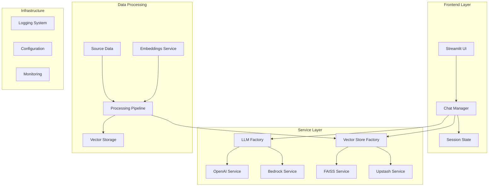
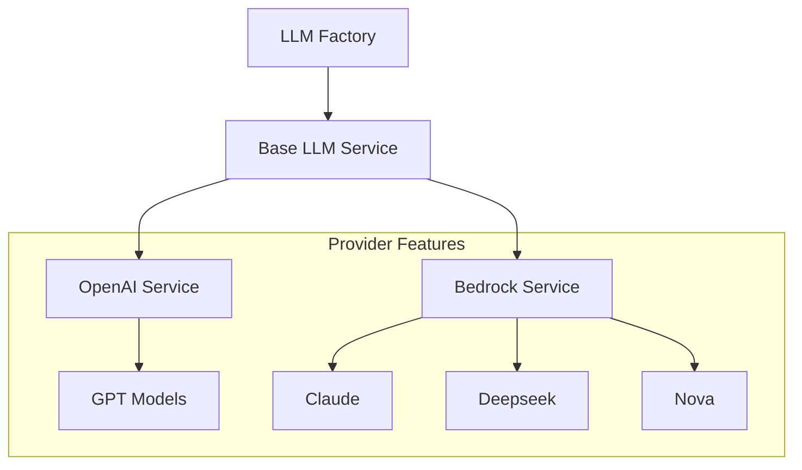
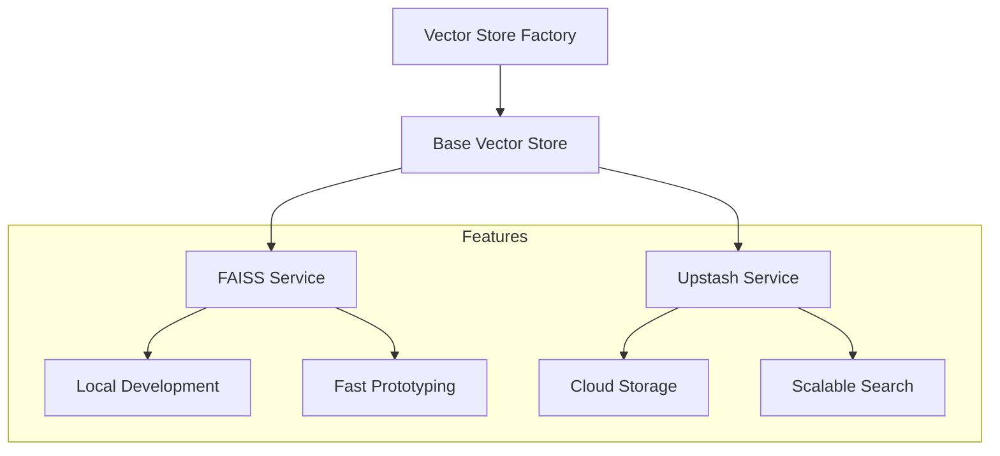
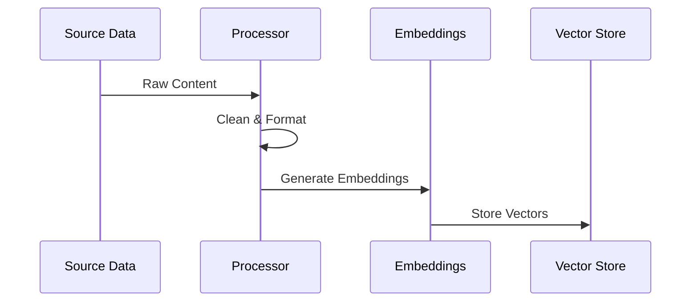

# LoreChat

A Streamlit-based conversational AI platform for intelligent website content interaction.

> For development and setup instructions, see [DEVELOPMENT.md](DEVELOPMENT.md)

## Project Overview

Hey there! Welcome to LoreChat, my GenAI portfolio project. I've built this to showcase how modern AI can transform the way we interact with website content. It's a Streamlit-based application that combines vector search and large language models to create intelligent, context-aware conversations.

LoreChat is the application component of a larger system. The infrastructure is managed by [LoreChatCDK](https://github.com/laialex501/lorechat-cdk), which handles the AWS deployment and cloud resources.

### Key Features
- Real-time chat with semantic understanding
- Flexible LLM integration (OpenAI, Claude, Deepseek, Nova)
- Local development with FAISS vector store
- Production deployment with Upstash Vector
- Containerized for consistent environments
- Comprehensive monitoring and logging

### Tech Stack
- Python 3.9
- Streamlit
- LangChain
- FAISS
- Upstash Vector
- AWS SDK
- Docker/Finch
- pytest

## Architecture Overview

Let's dive into LoreChat's architecture. Here's how the components work together:

This architecture reflects key design decisions that prioritize flexibility, maintainability, and performance. Let me walk you through the main components:

1. **Frontend Layer**: Built with Streamlit for rapid development and clean UI
2. **Service Layer**: Uses factory patterns for provider flexibility
3. **Data Processing**: Handles content ingestion and vectorization
4. **Infrastructure**: Manages configuration, logging, and monitoring

## Design Philosophy

I chose Python and Streamlit for this project because they offer the perfect balance of development speed and production readiness. The architecture follows these core principles:

1. **Provider Independence**
   - Factory patterns for LLM and vector store services
   - Abstract interfaces for core components
   - Easy integration of new providers

2. **Development Experience**
   - Local FAISS for rapid development
   - Docker/Finch for environment consistency
   - Comprehensive logging and monitoring

3. **Production Ready**
   - Containerized deployment
   - Cloud service integration
   - Scalable architecture

## Core Components

### LLM Integration

The LLM service uses a factory pattern for flexible provider integration:

This design allows:
- Runtime provider switching
- Easy addition of new providers
- Consistent interface across models
- Fallback strategies

### Vector Store

The vector store implementation supports both development and production environments:

Key features:
- Automatic initialization from sample data
- Persistent storage options
- Efficient vector search
- Cloud service integration

### Data Processing

The data processing pipeline handles content ingestion and vectorization:

This pipeline:
- Processes HTML content
- Generates embeddings
- Stores vector data
- Maintains data consistency

## Integration Points

### AWS Services

LoreChat integrates seamlessly with AWS services:
- Bedrock for LLM capabilities
- Lambda for data processing
- ECS for deployment
- CloudWatch for monitoring

### Vector Database

I chose Upstash Vector for production after evaluating several options:
- Generous free tier
- Simple integration
- Pay-per-use pricing
- Hybrid search capabilities

The abstracted interface means we can switch providers if needed.

## Performance and Scaling

The application is optimized for:
- Streamlit's concurrent user limitations (~50-100 active users)
- Real-time chat interactions with response streaming
- Moderate-sized document collections (tested with sample documentation)
- Multiple LLM provider support through factory pattern

Key optimizations:
- Efficient vector search with FAISS/Upstash
- Response streaming for better UX
- Session-based state management
- Containerized deployment for consistent scaling

## Monitoring and Logging

Comprehensive monitoring includes:
- Request tracking
- Error logging
- Performance metrics
- Resource utilization

Logs provide:
- Structured data
- Error tracing
- Performance insights
- Usage patterns

## Future Improvements

While the current system is robust, there's always room for growth:
- Multi-agent conversations
- Voice interface integration
- Enhanced content generation
- Advanced caching strategies
- Improved context handling
- Custom model fine-tuning

## License

This project is licensed under the MIT License. This means you are free to use, modify, and distribute the software, subject to the terms and conditions of the MIT License. For more details, please see the LICENSE file in the project repository.
