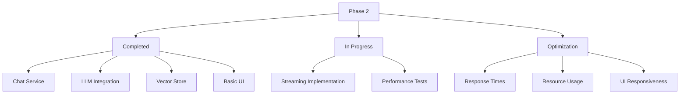

# SiteChat Active Context

## Current Development Phase
We are in **Phase 2: Core Implementation** with focus on streaming optimization.

## Current Focus Areas

### 1. Implementation Status

### 2. Core Components Status

#### Completed Components
- Full chat service implementation with async processing
- OpenAI and Bedrock LLM integrations
- FAISS vector store with embeddings support
- Basic Streamlit chat interface with session management
- Error handling and logging system
- Configuration management
- Docker development environment

#### In Progress
- Streaming response implementation
- Real-time UI updates
- Performance optimization
- Error recovery in streaming mode

#### Optimization Focus
- Response streaming efficiency
- Vector search concurrency
- Resource utilization
- UI responsiveness

## Recent Changes

### 1. Streaming Implementation
- Added streaming support to LLM service
- Implemented async generators for response streaming
- Updated chat service for streaming handling
- Enhanced UI for real-time updates

### 2. Performance Improvements
- Concurrent vector store context fetching
- Parallel message processing
- Improved error handling with retries
- Enhanced state management

### 3. Known Issues
- Streaming implementation needs refinement
- UI rerun efficiency can be improved
- Error handling in streaming mode needs enhancement
- State management during streaming needs optimization

## Active Decisions

### 1. Technical Decisions
- Async generators for streaming
- Concurrent context fetching
- Session-based state management
- Comprehensive error handling

### 2. Implementation Priorities
- Fix streaming implementation
- Optimize UI updates
- Enhance error recovery
- Improve user experience

## Next Steps

### Immediate Tasks
1. **Streaming Fixes**
   - Review async generator implementation
   - Fix return value in async generator
   - Improve error handling during streaming
   - Optimize UI rerun mechanism

2. **UI Optimization**
   - Reduce unnecessary reruns
   - Improve streaming state management
   - Enhance visual feedback
   - Optimize message updates

3. **Error Handling**
   - Better recovery in streaming mode
   - Improved error messages
   - Graceful degradation
   - State cleanup

### Future Improvements
1. **Performance**
   - Cache frequently accessed contexts
   - Optimize vector search timing
   - Reduce UI update frequency
   - Improve resource usage

2. **User Experience**
   - Smoother streaming updates
   - Better loading indicators
   - Improved error feedback
   - Enhanced visual design

## Current Challenges

### Technical Challenges
1. **Streaming Implementation**
   - Async generator complexity
   - UI update efficiency
   - Error recovery
   - State management

2. **Performance**
   - Response time optimization
   - Resource efficiency
   - Concurrent processing
   - UI responsiveness

## Environment Status

### Development Environment
- Fully functional Docker setup
- Complete local development workflow
- Comprehensive tooling
- Testing infrastructure

### Testing Environment
- Integration test framework
- Performance testing tools
- Error simulation
- Load testing capability

## Documentation Status

### Updated Documentation
- Service implementations
- Configuration guide
- Development workflow
- Error handling

### In Progress
- Streaming implementation details
- Performance optimization guide
- Testing procedures
- UI optimization strategies

## Risk Management

### Current Risks
1. **Streaming Performance**
   - UI update efficiency
   - Resource utilization
   - Error recovery
   - State management

2. **Integration**
   - Provider reliability
   - Error handling coverage
   - Resource constraints
   - Scaling considerations

### Mitigation Strategies
- Comprehensive streaming tests
- UI performance monitoring
- Robust error handling
- Resource optimization
