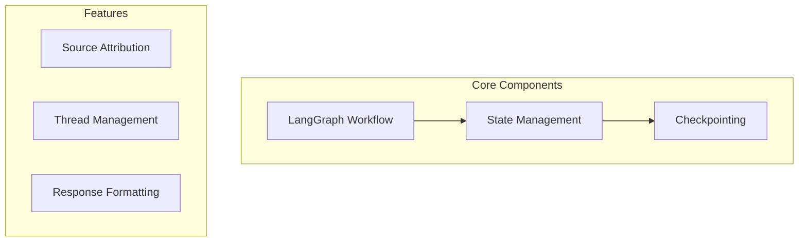

# LoreChat Active Context

## Current Status
Phase: LangGraph Implementation

### Recent Updates
1. **LangGraph Migration**
   - Moved from custom chains to LangGraph workflow
   - Added state management with ChatState
   - Set up checkpointing for chat sessions

2. **Vector Store Updates**
   - Added source URL tracking in responses
   - Improved metadata handling in Upstash
   - Enhanced search result formatting

3. **Chat Flow**
   - Built two-node graph: retrieve and respond
   - Added thread ID support for sessions
   - Improved response formatting with sources

## Current Focus

### Implementation Progress


### Known Issues
- Need to test thread persistence
- Response streaming optimization
- Memory management scaling

## Next Actions

### Immediate
1. Test thread ID persistence
2. Optimize response streaming
3. Add error recovery
4. Enhance monitoring

### Short Term
1. Scale memory management
2. Add more graph nodes
3. Improve error handling
4. Update documentation

## Technical Notes

### Graph Structure
```python
# Main workflow nodes
retrieve_context -> generate_response

# State management
class ChatState(MessagesState):
    messages: List[BaseMessage]
    retrieved_docs: List[Document]
```

### Key Features
- Thread-based session management
- Source URL tracking in responses
- Checkpointing for state persistence
- Hybrid search with metadata

## Current Risks
- Session scaling with threads
- Memory usage in long chats
- Response latency impact
