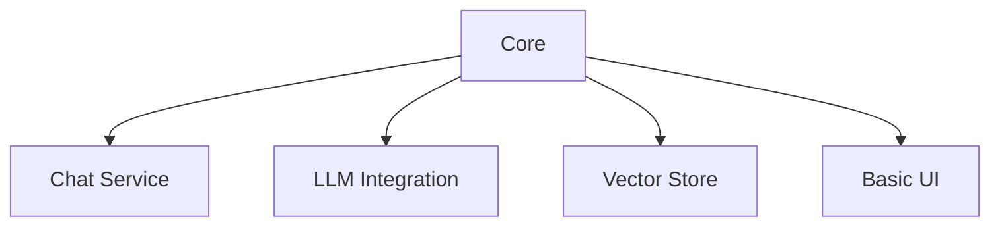

# SiteChat Active Context

## Current Status
Phase 2: Core Implementation (Streaming Focus)

### Recent Updates
1. **Vectorstore Service**
   - Converted to synchronous operations
   - Removed async methods
   - Updated abstract base class

2. **Streaming**
   - Added LLM service support
   - Implemented response streaming
   - Enhanced UI updates

3. **Performance**
   - Improved error handling
   - Enhanced state management
   - Optimized vector store operations

## Current Focus

### Completed

### In Progress
- Streaming refinements
- UI optimization
- Performance testing
- Error handling improvements

### Known Issues
- UI rerun efficiency
- Streaming error handling
- State management optimization

## Next Actions

### Immediate
1. Update async vectorstore references
2. Complete streaming implementation
3. Optimize UI updates
4. Enhance error handling

### Short Term
1. Performance optimization
2. Testing improvements
3. Documentation updates

## Technical Focus
- Streaming implementation
- UI responsiveness
- Error recovery
- Resource optimization

## Current Risks
- Streaming performance
- Resource utilization
- Error handling coverage
- Integration reliability
