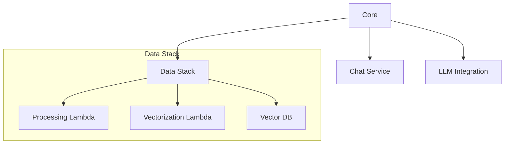
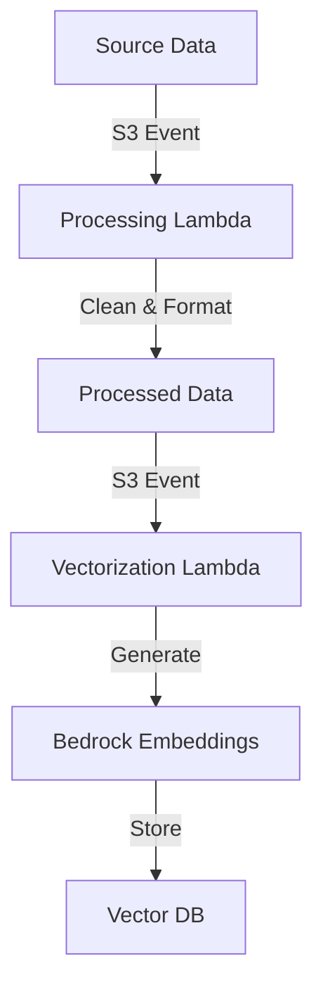

# SiteChat Active Context

## Current Status
Phase 2: Core Implementation (Data Pipeline Integration)

### Recent Updates
1. **Vector Store Migration**
   - Transitioned from OpenSearch to Upstash Vector
   - Implemented vector store factory with Upstash integration
   - Enhanced data storage and retrieval efficiency

2. **Data Processing Pipeline**
   - Implemented Data Stack in CDK
   - Created Lambda functions for data processing
   - Added Bedrock model access permissions
   - Integrated Upstash Vector for embeddings storage
   - Enhanced error handling and monitoring

3. **Architecture Improvements**
   - Streamlined stack organization
   - Enhanced error handling and logging
   - Improved security with IAM roles and policies

4. **Container Build System Update**
   - Added support for Finch as an alternative to Docker
   - Updated Dockerfiles and docker-compose files for both dev and prod environments
   - Implemented USE_FINCH build argument to control Finch usage
   - Set platform to linux/arm64 for improved compatibility

## Current Focus

### Completed

### In Progress
- Data pipeline testing and validation
- Lambda function error handling
- Upstash Vector integration testing
- Performance optimization for vector operations
- Documentation updates

### Known Issues
- Lambda cold start performance
- Vector store query optimization
- Error handling in data pipeline
- Integration test coverage
- Query rewriting system needed
- Prompt engineering improvements required
- Internet search tools integration pending
- Vector query optimization needed

## Next Actions

### Immediate
1. Complete Lambda function implementations
2. Validate Upstash Vector integration
3. Test data processing pipeline
4. Update system documentation
5. Test and validate Finch-based builds in both dev and prod environments
6. Update CI/CD pipelines to support Finch (if applicable)
7. Document Finch usage in project README and developer guidelines

### Short Term
1. Optimize Lambda performance
2. Enhance monitoring and logging
3. Implement comprehensive testing
4. Fine-tune vector store operations
5. Integrate internet search tools
6. Implement agentic flow system
7. Implement prompt engineering improvements
8. Develop query rewriting system

## Technical Focus
- Data pipeline reliability
- Vector store performance
- Lambda function optimization
- Error handling and recovery
- Security and permissions

## Current Risks
- Data processing pipeline reliability
- Lambda execution constraints
- Vector store query performance
- Integration complexity
- Error handling coverage

## Implementation Notes

### Data Pipeline Flow

### Key Considerations
1. **Data Processing**
   - Input validation
   - Error handling
   - Retry mechanisms
   - Performance optimization

2. **Vector Store Integration**
   - Query optimization
   - Connection management
   - Error recovery
   - Performance monitoring

3. **Security**
   - IAM roles and policies
   - Secret management
   - Access controls
   - Data encryption

4. **Monitoring**
   - Lambda metrics
   - Pipeline health
   - Vector store performance
   - Error tracking
