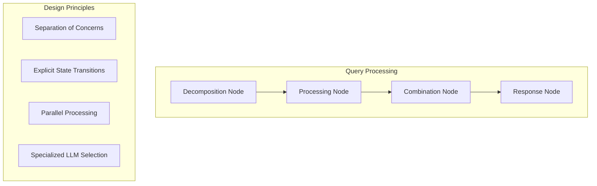

# LoreChat Active Context

## Current Status
Phase: Agentic Retrieval Implementation with Specialized LLM Configuration

### Recent Architectural Decisions

1. **Agentic Retrieval System**
   - **Decision**: Implement a graph-based agentic workflow with specialized nodes
   - **Rationale**: Traditional chain-based approaches lack the flexibility and explicit state management needed for complex query handling
   - **Tradeoffs**: Increased architectural complexity for better separation of concerns and maintainability
   - **Benefits**: Clear reasoning paths, parallel processing capabilities, and specialized LLM selection

2. **Service Architecture**
   - **Decision**: Adopt interface-based design with factory pattern
   - **Rationale**: Decouple UI from implementation details and enable runtime configuration
   - **Tradeoffs**: Additional abstraction layer vs. implementation flexibility
   - **Benefits**: Simplified dependency management, testability, and future provider swapping

3. **LLM Configuration System**
   - **Decision**: Implement node-specific LLM selection
   - **Rationale**: Different reasoning tasks benefit from different model capabilities
   - **Tradeoffs**: Increased API calls and complexity vs. optimized performance and cost
   - **Benefits**: Cost optimization, performance tuning, and specialized reasoning capabilities

## Technical Architecture

### Agentic Workflow Design

### Key Technical Tradeoffs

1. **Parallel Processing vs. Sequential Execution**
   - **Choice**: Parallel subquery processing with asyncio
   - **Tradeoff**: Increased memory usage vs. significantly reduced response time
   - **Mitigation**: Efficient error handling and state management to prevent resource leaks

2. **Specialized LLMs vs. Single Model**
   - **Choice**: Different LLMs for different reasoning tasks
   - **Tradeoff**: Increased API complexity vs. optimized performance and cost
   - **Mitigation**: Fallback mechanisms and configuration-based selection

3. **Enhanced State vs. Simple State**
   - **Choice**: Rich state model with subquery tracking
   - **Tradeoff**: Increased memory footprint vs. comprehensive tracking and error recovery
   - **Mitigation**: Efficient state serialization and cleanup

4. **Query Decomposition vs. Direct Processing**
   - **Choice**: Intelligent query decomposition for complex questions
   - **Tradeoff**: Additional LLM call overhead vs. more comprehensive answers
   - **Mitigation**: Complexity detection to bypass decomposition for simple queries

## Current Focus Areas

### Architecture Refinement
- Optimizing the balance between parallel processing and resource utilization
- Enhancing error propagation and recovery across node boundaries
- Improving state persistence and recovery mechanisms

### Performance Optimization
- Reducing latency in multi-LLM workflows
- Optimizing streaming response generation
- Implementing efficient memory management for complex queries

### Evaluation Framework
- Developing metrics for response quality assessment
- Creating benchmarks for different query types
- Building comparative analysis tools for LLM selection

## Next Strategic Directions

### Immediate Priorities
1. Refine the parallel processing architecture to optimize resource utilization
2. Enhance the streaming response system for progressive updates
3. Implement comprehensive error recovery across the graph workflow
4. Develop monitoring tools for multi-LLM performance analysis

### Medium-term Vision
1. Extend the agentic system with multi-hop reasoning capabilities
2. Implement dynamic LLM selection based on query characteristics
3. Develop adaptive decomposition strategies for different query types
4. Create a feedback loop system for continuous improvement

## Technical Risks and Mitigations

1. **Risk**: Increased latency with multiple LLM calls
   - **Mitigation**: Parallel processing, streaming responses, and optimized prompts

2. **Risk**: Memory usage with complex state management
   - **Mitigation**: Efficient state serialization and cleanup strategies

3. **Risk**: Error propagation across node boundaries
   - **Mitigation**: Comprehensive error handling and graceful degradation

4. **Risk**: Response quality inconsistency with complex queries
   - **Mitigation**: Specialized LLM selection and quality evaluation framework
