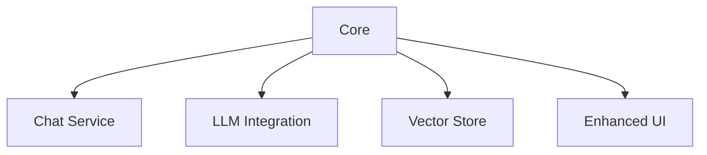

# SiteChat Active Context

## Current Status
Phase 2: Core Implementation (Architecture Refinement)

### Recent Updates
1. **Vector Store Service**
   - Optimized for synchronous operations
   - Improved data retrieval efficiency
   - Enhanced integration with chat service

2. **LLM Service**
   - Refined provider integration
   - Improved response streaming
   - Enhanced error handling and recovery

3. **Performance and Reliability**
   - Optimized resource utilization
   - Improved state management
   - Enhanced error handling across services

## Current Focus

### Completed

### In Progress
- Service integration refinements
- UI responsiveness improvements
- Comprehensive performance testing
- Error handling and recovery enhancements

### Known Issues
- UI update efficiency
- Edge case handling in streaming responses
- State management optimization

## Next Actions

### Immediate
1. Finalize service integration improvements
2. Optimize UI responsiveness
3. Conduct thorough performance testing
4. Enhance cross-service error handling

### Short Term
1. Scalability assessment and optimization
2. Expand test coverage
3. Update technical documentation

## Technical Focus
- Service integration and communication
- UI performance and user experience
- System reliability and error recovery
- Resource optimization and scalability

## Current Risks
- Service integration complexity
- Performance under high load
- Error handling coverage
- Scalability of current architecture
