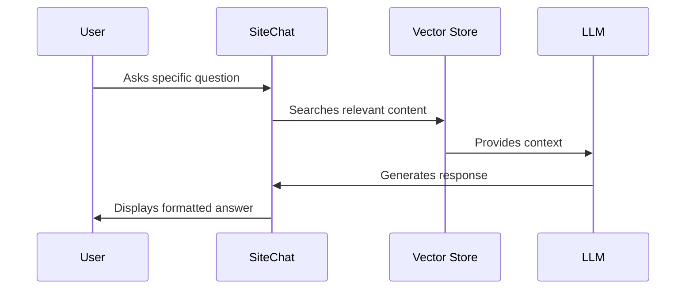
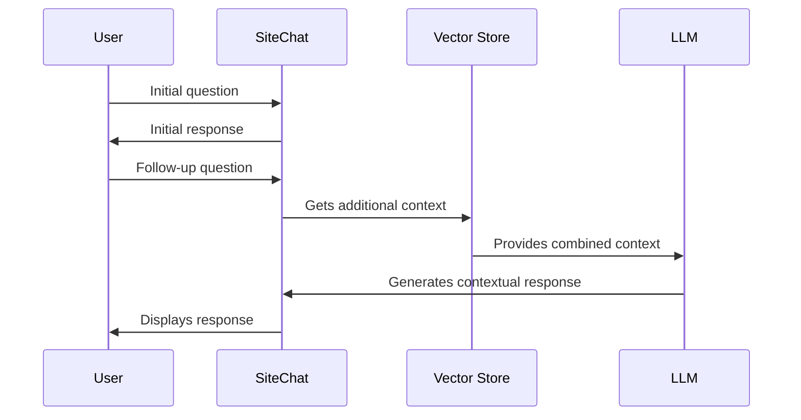

# SiteChat Product Context

## Problem Statement
Organizations need an efficient way to help users find and understand information from their websites. Traditional search functions and navigation can be cumbersome and may not always lead users to the exact information they need. Users often prefer conversational interfaces that can understand their questions in natural language and provide relevant, contextual responses.

## Solution Overview
SiteChat provides a conversational AI interface that allows users to interact with website content naturally. Instead of browsing through multiple pages or using keyword searches, users can ask questions in their own words and receive relevant, contextualized answers derived from the website's content.

## Core Value Propositions
1. **Natural Interaction**: Users can ask questions in plain language
2. **Contextual Understanding**: Responses consider the full context of the website content
3. **Immediate Access**: Quick, relevant answers without manual searching
4. **Flexible Integration**: Works with different LLM providers and can be adapted for various websites

## User Experience Goals

### Chat Interface Design
- **Simplicity**: Clean, intuitive interface with minimal learning curve
- **Responsiveness**: Real-time message updates and smooth interactions
- **Visual Clarity**: Clear distinction between user and assistant messages
- **Context Awareness**: Maintains conversation flow within the session

### Interaction Patterns
1. **Initial Engagement**
   - Welcome message introduces the chatbot's capabilities
   - Clear prompt placeholder guides users on how to ask questions
   - No setup or configuration required from users

2. **Conversation Flow**
   - Real-time message display
   - Visual feedback during response generation
   - Maintained chat history within session
   - Smooth scrolling and message transitions

3. **Response Presentation**
   - Formatted, readable responses
   - Clear differentiation between user and assistant messages
   - Support for markdown formatting in responses
   - Appropriate length and chunking of information

### Performance Expectations
- **Response Time**: < 2 seconds for typical queries
- **Reliability**: Consistent, stable performance
- **Scalability**: Handles multiple concurrent users smoothly
- **Error Handling**: Clear, user-friendly error messages

## User Scenarios

### Scenario 1: Quick Information Lookup

### Scenario 2: Multi-turn Conversation

## Success Metrics

### User Experience Metrics
- Response accuracy
- Query resolution time
- Session duration
- Conversation completion rate

### Technical Performance Metrics
- Response latency
- Concurrent user handling
- Error rate
- Resource utilization

## Design Principles

### 1. Simplicity First
- Minimize cognitive load
- Clear, focused interface
- Intuitive interaction patterns

### 2. Responsive Design
- Real-time updates
- Visual feedback
- Smooth transitions

### 3. Contextual Intelligence
- Maintain conversation context
- Relevant, focused responses
- Natural language understanding

### 4. Error Resilience
- Graceful error handling
- Clear error messages
- Recovery suggestions

## Future Considerations

### Potential Enhancements
- Multi-language support
- Rich media responses
- User feedback collection
- Analytics dashboard
- Custom styling options

### Integration Opportunities
- Authentication systems
- Content management systems
- Analytics platforms
- Monitoring tools

## Limitations and Constraints

### Current Limitations
- Session-only history
- No user authentication
- Limited to text responses
- Development-mode vector store

### Technical Constraints
- Streamlit framework limitations
- LLM API dependencies
- Container resource limits
- Development environment restrictions
