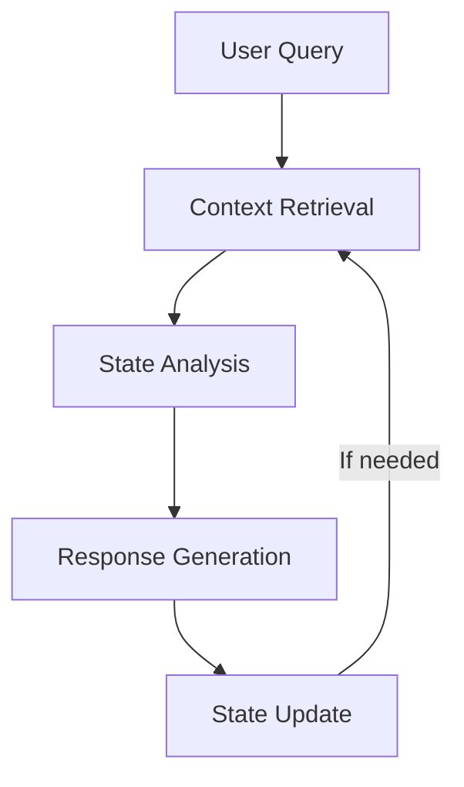

# LoreChat Product Context

## Problem & Solution
LoreChat provides intelligent document interaction through LangChain-powered conversational AI. Users receive contextual, relevant answers from website content through graph-based conversation flows.

## Core Value Propositions
1. Intelligent conversation flows with LangGraph
2. Contextual understanding via LangChain RAG
3. Streamlined memory management
4. Flexible LLM provider integration

## User Experience Goals
- Natural conversation progression
- Context-aware responses
- Clear conversation state management
- Sub-second response times

## Key Interaction Patterns

## Performance Targets
- Response time: < 1 second
- Concurrent users: ~50
- Context relevance: > 90%
- Memory efficiency: < 500MB per session

## Success Metrics
- Query resolution accuracy
- Conversation coherence
- Resource utilization
- User satisfaction

## Technical Constraints
- Streamlit session state limitations
- LLM API dependencies
- Container resource limits
- AWS service quotas
