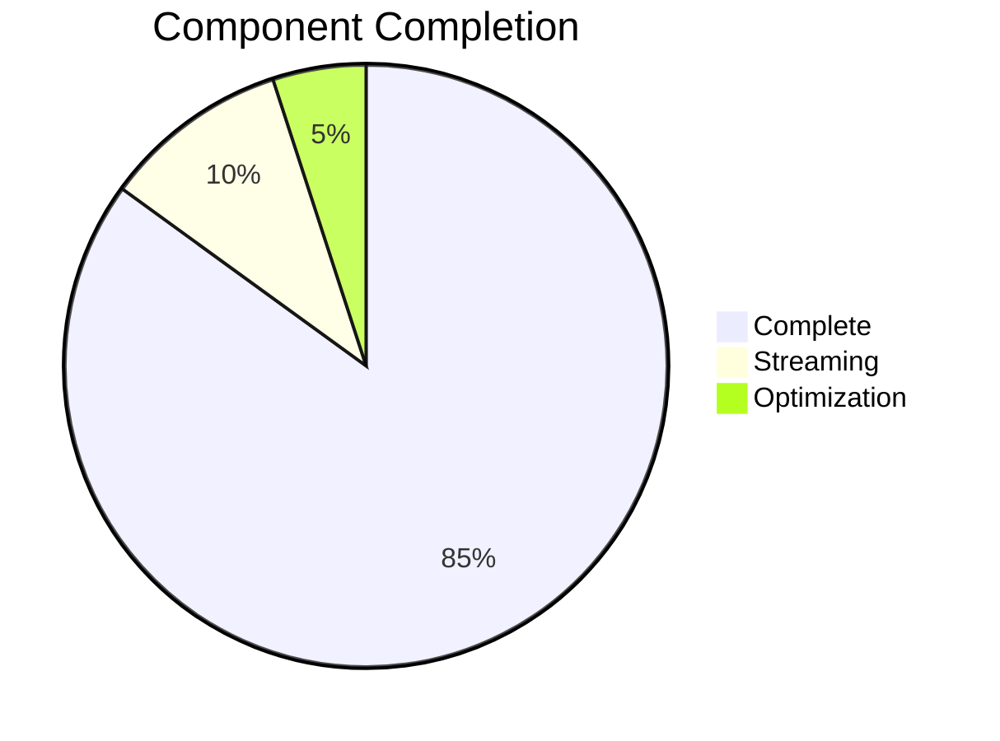

# SiteChat Progress Tracker

## Project Status: Phase 2 - Core Implementation (Streaming Focus)

### Development Progress

## Completed Features

### Core Components
- ✅ Chat service (async processing, context retrieval, history management)
- ✅ LLM integration (OpenAI, Bedrock, provider factory)
- ✅ Vector store (FAISS, synchronous operations)
- ✅ Basic Streamlit UI
- ✅ Development environment (Docker, hot reloading, debugging)

### Recent Improvements
- ✅ Streaming support in LLM service
- ✅ Async generator implementation
- ✅ Error handling and state management enhancements

## In Progress

### Streaming Refinement
- 🔄 Optimize UI rerun mechanism
- 🔄 Improve streaming error handling
- 🔄 Enhance streaming state management

### Testing
- [ ] Streaming response tests
- [ ] Performance benchmarks
- [ ] Load testing
- [ ] Error scenario coverage

### Optimization
- [ ] Response streaming efficiency
- [ ] Vector search concurrency
- [ ] UI update frequency
- [ ] Resource utilization

## Known Issues

### High Priority
- [ ] Async generator implementation refinement
- [ ] UI rerun optimization
- [ ] Streaming error handling improvements
- [ ] State management enhancements

### Medium Priority
- [ ] Reduce unnecessary UI updates
- [ ] Improve resource usage
- [ ] Add streaming performance monitoring

## Next Actions

### Immediate
1. Update vectorstore references (remove remaining async operations)
2. Complete streaming implementation refinements
3. Optimize UI updates and resource usage
4. Enhance error handling and recovery

### Short-term
1. Implement comprehensive streaming tests
2. Optimize overall performance
3. Improve UI responsiveness
4. Update documentation (focus on streaming and optimization)

## Testing Status
- ✅ Basic service layer, component, and utility tests
- 🔄 API and service interaction tests (partial)
- [ ] Streaming end-to-end tests
- [ ] Performance tests

## Key Metrics to Establish
- Response times (initial display, streaming updates, context retrieval)
- Resource usage (memory, CPU, vector store efficiency)
- Scalability (streaming performance, concurrent users)

## Next Phase Preparation
- Documentation: Streaming implementation, UI optimization, error handling
- Infrastructure: Performance monitoring, resource tracking, state management
- Testing: Streaming responses, UI updates, error scenarios, performance
