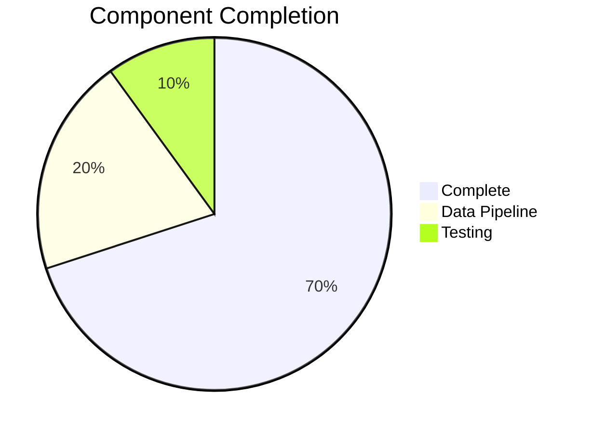

# LoreChat Progress Tracker

## Project Status: Phase 2 - Core Implementation (Data Pipeline Focus)

### Development Progress

## Completed Features

### Core Components
- ✅ Chat service (async processing, context retrieval, history management)
- ✅ LLM integration (OpenAI, Bedrock, provider factory)
- ✅ Basic Streamlit UI
- ✅ Development environment (Docker, hot reloading, debugging)
- ✅ Vector store migration (OpenSearch removal, Upstash Vector setup)

### Recent Improvements
- ✅ Data Stack implementation in CDK
- ✅ Bedrock model access permissions
- ✅ Vector store factory with Upstash integration
- ✅ Lambda function scaffolding

## In Progress

### Data Pipeline Implementation
- 🔄 Data processing Lambda function
- 🔄 Vectorization Lambda function
- 🔄 Upstash Vector integration testing
- 🔄 Error handling and logging

### Testing
- [ ] Lambda function unit tests
- [ ] Data pipeline integration tests
- [ ] Vector store performance tests
- [ ] Error scenario coverage

### Optimization
- [ ] Lambda cold start performance
- [ ] Vector store query efficiency
- [ ] Resource utilization
- [ ] Pipeline throughput

## Known Issues

### High Priority
- [ ] Lambda function error handling
- [ ] Vector store connection management
- [ ] Pipeline monitoring implementation
- [ ] Integration test coverage

### Medium Priority
- [ ] Lambda performance optimization
- [ ] Improve resource usage
- [ ] Add pipeline performance monitoring
- [ ] Documentation updates

## Next Actions

### Immediate
1. Complete Lambda function implementations
2. Implement error handling and logging
3. Set up monitoring and alerts
4. Create integration tests

### Short-term
1. Optimize Lambda performance
2. Fine-tune vector store operations
3. Enhance pipeline reliability
4. Update documentation

## Testing Status
- ✅ Basic service layer tests
- ✅ Vector store integration tests
- 🔄 Lambda function tests (in progress)
- [ ] Pipeline integration tests
- [ ] Performance tests

## Key Metrics to Establish
- Pipeline processing times
- Lambda execution metrics
- Vector store performance
- Error rates and recovery times
- Resource utilization

## Next Phase Preparation
- Documentation: Data pipeline, vector store integration, Lambda functions
- Infrastructure: Monitoring, logging, alerting
- Testing: Pipeline validation, performance testing, load testing
- Operations: Maintenance procedures, troubleshooting guides

## Infrastructure Updates
- ✅ Data Stack creation
- ✅ S3 bucket setup
- ✅ Lambda function deployment
- ✅ IAM role configuration
- 🔄 Monitoring setup

## Vector Store Migration
- ✅ OpenSearch removal
- ✅ Upstash Vector integration
- ✅ Factory pattern implementation
- 🔄 Performance optimization
- 🔄 Query efficiency improvements
