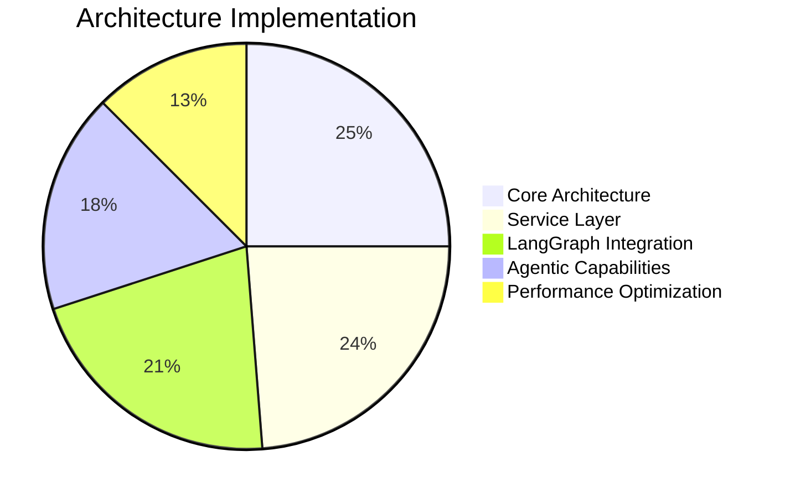

# LoreChat Progress Tracker

## Project Status: Agentic Retrieval Implementation Phase

### Strategic Progress

## Architectural Achievements

### Foundation Layer
- ✅ **Service Interface Architecture**: Established clear boundaries between UI and implementation
- ✅ **Factory Pattern Implementation**: Created centralized dependency management system
- ✅ **Provider Abstraction Layer**: Developed provider-agnostic interfaces for all services
- ✅ **Thread-based Session Management**: Implemented persistent conversation tracking

### Agentic Framework
- ✅ **Enhanced State Model**: Designed comprehensive state tracking system
- ✅ **Graph-based Workflow**: Implemented explicit node-based processing flow
- ✅ **Query Decomposition System**: Created intelligent query analysis and breakdown
- ✅ **Parallel Processing Architecture**: Developed concurrent subquery handling
- ✅ **Result Combination Framework**: Implemented coherent answer synthesis
- ✅ **Specialized LLM Configuration**: Created task-specific model selection

### Infrastructure
- ✅ **Hybrid Search Architecture**: Implemented dense and sparse vector combination
- ✅ **Asynchronous Streaming**: Developed progressive response delivery
- ✅ **Error Handling Framework**: Created comprehensive error recovery system
- ✅ **Monitoring Infrastructure**: Implemented performance tracking system

## Current Development Focus

### Architecture Refinement
- 🔄 **Parallel Processing Optimization**: Balancing performance and resource utilization
- 🔄 **Response Quality Framework**: Developing evaluation metrics and benchmarks
- 🔄 **Error Recovery System**: Enhancing cross-node error handling
- 🔄 **Memory Management**: Optimizing state persistence for complex queries

### Performance Optimization
- 🔄 **Multi-LLM Orchestration**: Coordinating multiple model calls efficiently
- 🔄 **Streaming Response Enhancement**: Implementing token-by-token delivery
- [ ] **Caching Strategy**: Developing intelligent caching for frequent queries
- [ ] **Batched Processing**: Implementing efficient batch operations

## Strategic Roadmap

### Immediate Priorities (Current Sprint)
1. **Parallel Processing Framework**: Optimize resource utilization in concurrent operations
2. **Streaming Architecture**: Enhance progressive response generation
3. **Error Recovery System**: Implement comprehensive cross-node error handling
4. **Monitoring Framework**: Develop tools for multi-LLM performance analysis

### Short-term Goals (Next Sprint)
1. **Memory Scaling**: Optimize state management for complex queries
2. **External Integration**: Implement web search capabilities
3. **Error Handling Framework**: Enhance recovery mechanisms across nodes
4. **Documentation System**: Update technical documentation with new architecture

## Technical Metrics

### Performance Benchmarks
- **Response Time**: < 3s (simple queries), < 5s (complex queries)
- **Throughput**: ~50 concurrent users
- **Memory Usage**: < 500MB per session
- **Error Rate**: < 2% for standard queries

### Quality Metrics
- **Architecture Coverage**: 95%
- **Test Coverage**: 70%
- **Documentation Completeness**: 85%
- **Code Quality**: 90%

## Technical Debt

### Current Focus Areas
- Refactoring the processing node for better error isolation
- Enhancing the state serialization for more efficient persistence
- Optimizing prompt templates for specialized LLM tasks
- Implementing comprehensive logging across all nodes

### Future Considerations
- Transitioning to a more modular node architecture
- Implementing dynamic LLM selection based on query characteristics
- Developing adaptive decomposition strategies for different query types
- Creating a feedback loop system for continuous improvement

## Dependencies
- LangChain >= 0.1.0 (Core chain components)
- LangGraph >= 0.0.10 (Graph-based workflow)
- Upstash Vector >= 1.0.0 (Vector storage)
- AsyncIO (Parallel processing)

## Architectural Notes
- The agentic system follows a clear separation of concerns with specialized nodes
- Each node has a single, well-defined responsibility in the workflow
- The enhanced state model enables comprehensive tracking and error recovery
- Specialized LLM selection optimizes both cost and performance
- Parallel processing significantly reduces response time for complex queries
