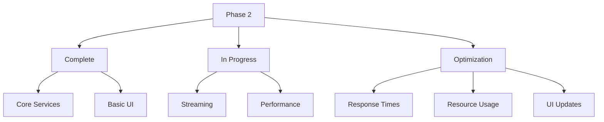
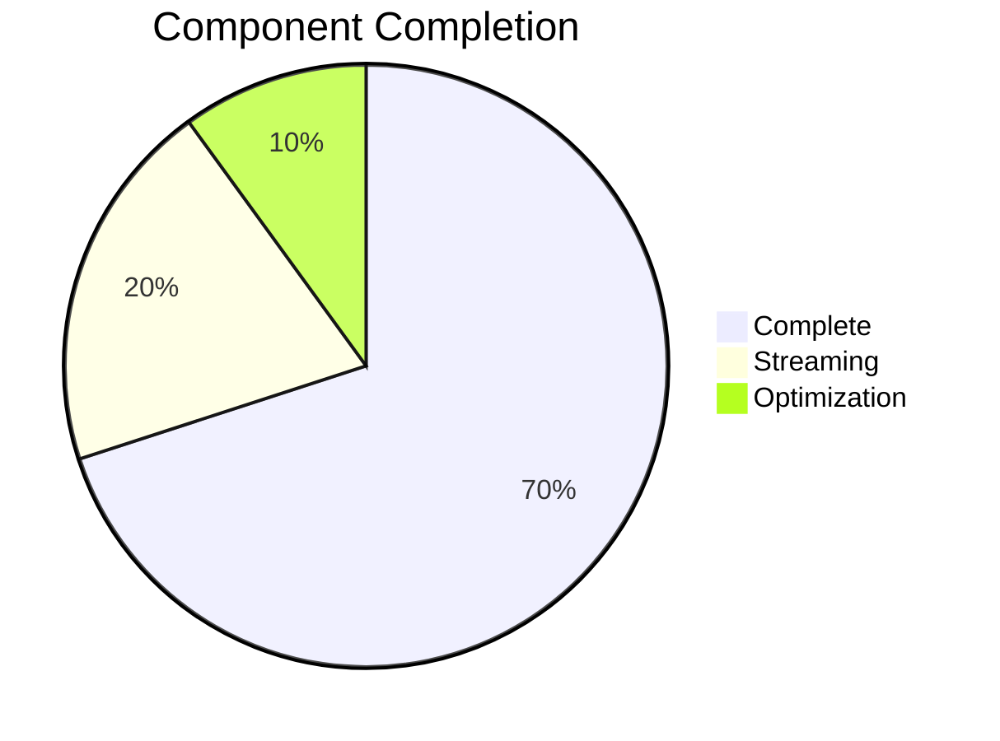

# SiteChat Progress Tracker

## Project Status Overview

### Current Phase: Phase 2 - Core Implementation (Streaming Focus)

## What Works

### 1. Chat Service
- ✅ Async message processing
- ✅ Context retrieval integration
- ✅ Conversation history management
- ✅ Basic error handling and logging
- ✅ Provider-agnostic design
- 🔄 Streaming response handling (needs refinement)

### 2. LLM Integration
- ✅ OpenAI provider implementation
- ✅ Bedrock provider implementation
- ✅ Provider factory pattern
- ✅ Basic response generation
- ✅ Configuration validation
- 🔄 Streaming implementation (needs fix)

### 3. Vector Store
- ✅ FAISS service implementation
- ✅ Multi-provider embeddings support
- ✅ Context retrieval system
- ✅ Error handling
- ✅ Concurrent context fetching

### 4. UI Implementation
- ✅ Streamlit chat interface
- ✅ Session state management
- ✅ Message display with avatars
- ✅ Basic async handling
- 🔄 Streaming UI updates (needs optimization)
- 🔄 Real-time feedback (needs improvement)

### 5. Development Environment
- ✅ Docker configuration
- ✅ Environment management
- ✅ Local development workflow
- ✅ Hot reloading
- ✅ Debug capabilities

## What's In Progress

### 1. Streaming Implementation
- [ ] Fix async generator in LLM service
- [ ] Optimize UI rerun mechanism
- [ ] Improve error handling in streaming mode
- [ ] Enhance state management during streaming
- [ ] Add proper cleanup on errors

### 2. Testing
- [ ] Streaming response tests
- [ ] Performance benchmarks
- [ ] Load testing
- [ ] Error scenario coverage
- [ ] UI update efficiency tests

### 3. Optimization
- [ ] Response streaming efficiency
- [ ] Vector search concurrency
- [ ] UI update frequency
- [ ] Resource utilization
- [ ] Error recovery

## Current Status

### 1. Development Progress

### 2. Component Status

#### Production Ready
- Basic chat service
- LLM provider integrations
- Vector store functionality
- Basic Streamlit UI
- Development environment

#### Needs Immediate Attention
- Streaming response implementation
- UI update mechanism
- Error handling in streaming mode
- State management during streaming

#### Needs Optimization
- Response streaming efficiency
- UI update frequency
- Resource utilization
- Error recovery mechanisms

## Known Issues

### High Priority
- [ ] Fix async generator implementation
- [ ] Optimize UI rerun mechanism
- [ ] Improve streaming error handling
- [ ] Enhance state management

### Medium Priority
- [ ] Reduce unnecessary UI updates
- [ ] Improve resource usage
- [ ] Add streaming performance monitoring
- [ ] Create streaming implementation guide

## Next Actions

### Immediate Priority
1. Fix streaming implementation
2. Optimize UI updates
3. Improve error handling
4. Enhance state management

### Short-term Goals
1. Add streaming tests
2. Optimize resource usage
3. Improve UI responsiveness
4. Document streaming implementation

## Testing Status

### Unit Tests
- [x] Basic service layer tests
- [x] Component tests
- [x] Utility tests
- [ ] Streaming implementation tests

### Integration Tests
- [½] API integration tests
- [½] Service interaction tests
- [ ] Streaming end-to-end tests
- [ ] Performance tests

## Documentation Status

### Complete
- Basic service implementations
- Configuration guide
- Development workflow
- Basic error handling

### In Progress
- Streaming implementation details
- UI optimization strategies
- Performance guidelines
- Error handling in streaming mode

## Performance Metrics (To Be Established)

### Response Times
- Initial message display
- Streaming update frequency
- Context retrieval
- UI rerun efficiency

### Resource Usage
- Memory during streaming
- CPU usage patterns
- Vector store efficiency
- UI update overhead

### Scalability
- Streaming performance
- Concurrent users
- Resource management
- Error recovery

## Next Phase Preparation

### Documentation Needs
- Streaming implementation guide
- UI optimization strategies
- Error handling patterns
- Performance guidelines

### Infrastructure Needs
- Streaming performance monitoring
- Resource usage tracking
- Error recovery mechanisms
- State management tools

### Testing Requirements
- Streaming response tests
- UI update benchmarks
- Error scenario coverage
- Performance metrics
