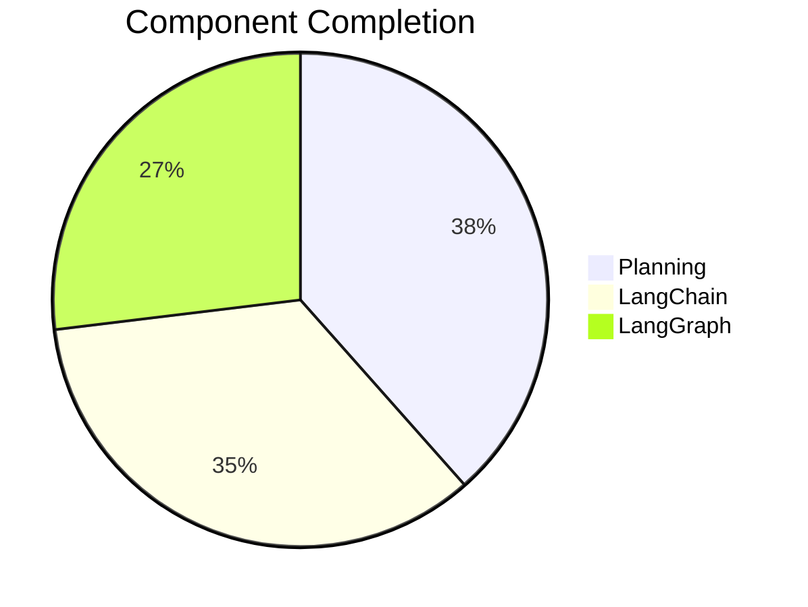

# LoreChat Progress Tracker

## Project Status: LangGraph Implementation Phase

### Development Progress

## Completed Features

### Architecture
- ✅ LangGraph workflow implementation
- ✅ State management with ChatState
- ✅ Thread-based checkpointing
- ✅ Source URL tracking

### Core Features
- ✅ Two-node graph workflow
- ✅ Thread ID support
- ✅ Source attribution
- ✅ Metadata handling

### Infrastructure
- ✅ Upstash vector store integration
- ✅ Hybrid search implementation
- ✅ Streaming responses
- ✅ Session management

## In Progress

### LangGraph Features
- 🔄 Thread persistence testing
- 🔄 Response optimization
- 🔄 Error recovery
- 🔄 Memory scaling

### Infrastructure
- [ ] Performance monitoring
- [ ] Error handling
- [ ] Load testing
- [ ] Documentation updates

## Next Steps

### Immediate (This Week)
1. Test thread ID persistence
2. Optimize response streaming
3. Add error recovery
4. Update monitoring

### Short-term (Next Week)
1. Scale memory management
2. Add graph nodes
3. Improve error handling
4. Update docs

## Testing Status
- ✅ Basic graph workflow
- ✅ Source attribution
- 🔄 Thread persistence
- [ ] Load testing

## Key Metrics
- Component conversion: 90%
- Test coverage: 60%
- Documentation: 80%
- Response time: < 2s

## Blockers
- None currently

## Dependencies
- LangChain >= 0.1.0
- LangGraph >= 0.0.10
- Upstash Vector >= 1.0.0

## Notes
- Thread IDs now used for session tracking
- Source URLs included in responses
- Metadata handling improved
- State persistence implemented
