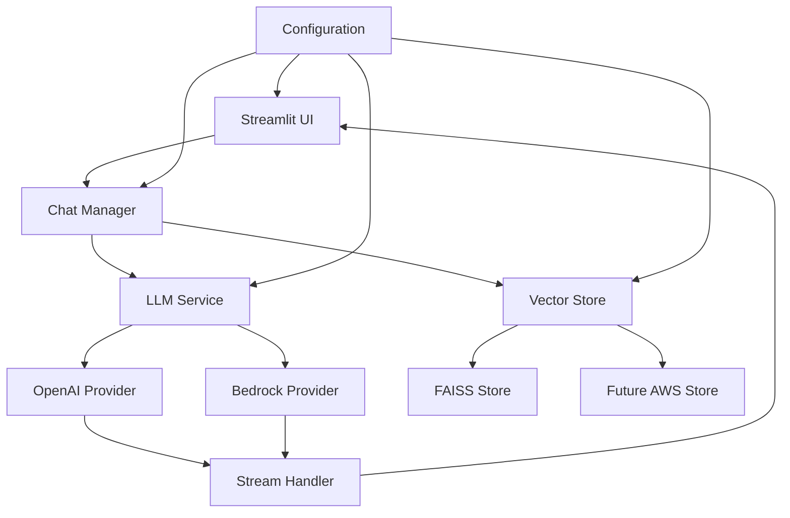
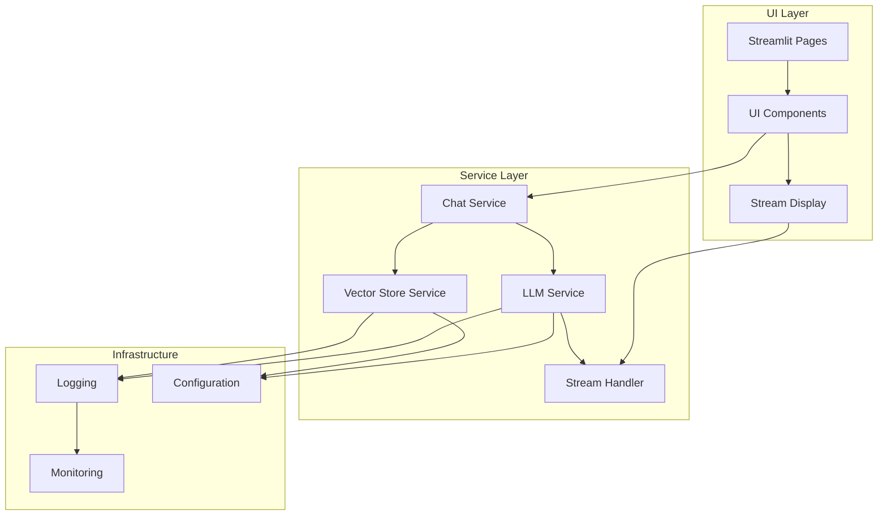
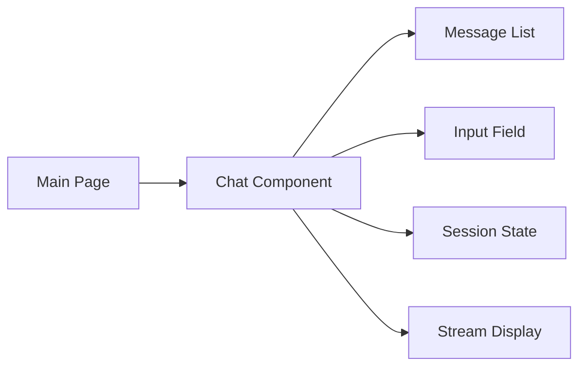
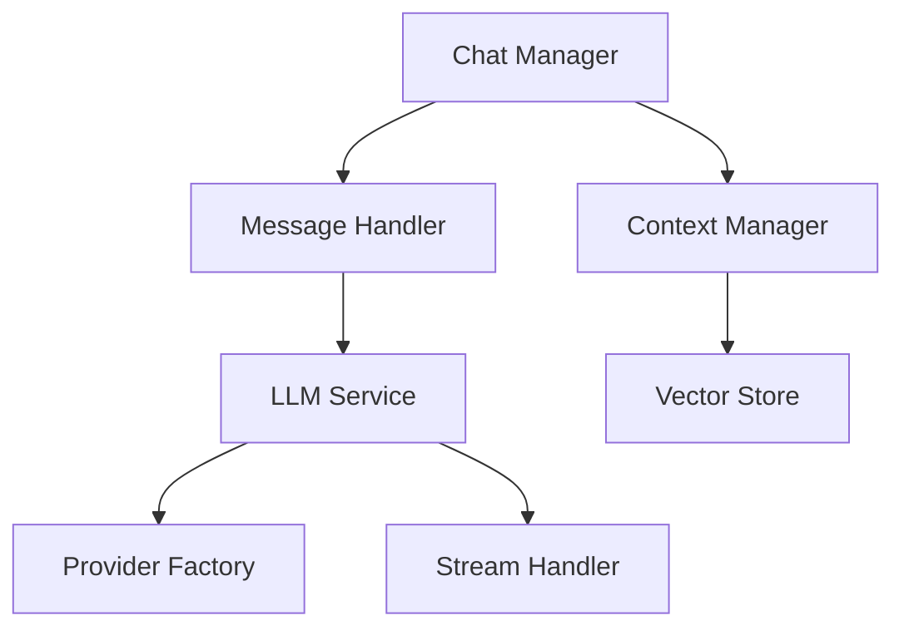
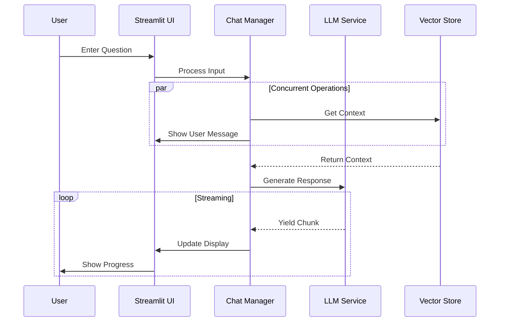
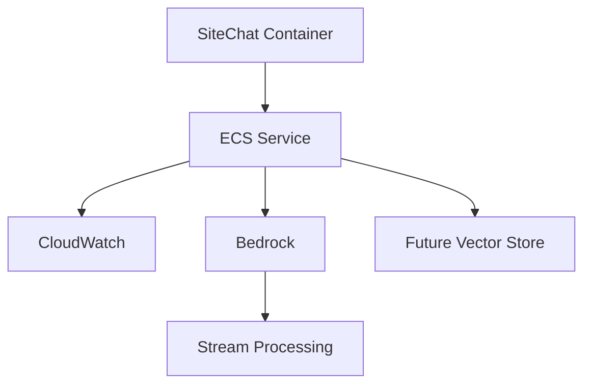

# SiteChat System Patterns

## System Architecture

### High-Level Architecture


### Component Structure


## Design Patterns

### 1. Service Abstraction Pattern
- **Interface Segregation**: Clear service interfaces for LLM and vector store
- **Provider Abstraction**: Unified interface for different LLM providers
- **Factory Pattern**: Service instantiation based on configuration
- **Streaming Pattern**: Async generator pattern for response streaming

Example (LLM Service with Streaming):
```python
class BaseLLMService(ABC):
    @abstractmethod
    async def generate_response(
        self,
        messages: List[BaseMessage],
        stream: bool = False
    ) -> Union[str, AsyncGenerator[str, None]]:
        pass

class OpenAIService(BaseLLMService):
    async def generate_response(
        self,
        messages: List[BaseMessage],
        stream: bool = False
    ) -> Union[str, AsyncGenerator[str, None]]:
        if not stream:
            response = await self.llm.agenerate([messages])
            return response.generations[0][0].text
        
        async def stream_response() -> AsyncGenerator[str, None]:
            async for chunk in self.llm.astream(messages):
                if isinstance(chunk, AIMessageChunk):
                    yield chunk.content
        
        return stream_response()
```

### 2. Streaming Implementation Pattern
- **Async Generators**: Stream response chunks
- **State Management**: Track streaming state
- **Error Handling**: Graceful error recovery
- **UI Updates**: Real-time content display

Example (Chat Service Streaming):
```python
class ChatService:
    async def process_message(
        self,
        message: str,
        history: List[ChatMessage],
        stream: bool = False
    ) -> Union[str, AsyncGenerator[str, None]]:
        # Concurrent context fetching
        context_task = asyncio.create_task(
            self.vector_store.get_relevant_context(message)
        )
        
        # Process history while fetching context
        messages = self._format_history(history)
        context = await context_task
        
        if stream:
            return self._stream_response(messages, context)
        return await self._generate_response(messages, context)
```

### 3. UI Streaming Pattern
- **Progressive Updates**: Show response as it arrives
- **State Management**: Track partial responses
- **Visual Feedback**: Indicate streaming status
- **Error Recovery**: Handle stream interruptions

Example (UI Implementation):
```python
async def handle_streaming_response(generator):
    full_response = []
    async for chunk in generator:
        full_response.append(chunk)
        st.session_state.current_response = "".join(full_response)
        st.experimental_rerun()
```

### 4. Configuration Management
- **Settings Hierarchy**: Environment-based configuration
- **Validation**: Pydantic models for type safety
- **Environment Isolation**: Development vs production settings
- **Streaming Config**: Stream-specific settings

### 5. Dependency Injection
- **Service Registry**: Centralized service management
- **Configuration Injection**: Runtime provider selection
- **Testing Support**: Easy service mocking
- **Stream Handlers**: Pluggable streaming components

### 6. Repository Pattern (Vector Store)
- **Data Access Abstraction**: Unified vector store interface
- **Implementation Swapping**: Easy switching between stores
- **Query Optimization**: Efficient similarity search
- **Concurrent Access**: Parallel context fetching

## Component Relationships

### 1. UI Layer


### 2. Service Layer


### 3. Data Flow with Streaming


## Technical Decisions

### 1. Framework Selection
- **Streamlit**: Rapid UI development with streaming support
- **LangChain**: LLM integration with async streaming
- **FAISS**: Efficient vector similarity search
- **Docker**: Container-based deployment

### 2. State Management
- Session-based chat history
- Streaming state tracking
- No persistent storage
- In-memory vector store for development

### 3. Error Handling
- Graceful stream interruption
- User-friendly error messages
- Comprehensive logging
- Error recovery strategies

### 4. Performance Optimization
- Concurrent context fetching
- Efficient stream processing
- Resource-aware container configuration
- Optimized vector search

## AWS Integration Design

### 1. Service Integration Points


### 2. Container Architecture
- ECS task definition
- Resource allocation
- Stream handling
- Health monitoring
- Auto-scaling rules

### 3. Monitoring Integration
- Stream performance metrics
- CloudWatch metrics
- Log aggregation
- Performance monitoring
- Error tracking

## Development Patterns

### 1. Local Development
- Docker Compose setup
- Environment configuration
- Hot reloading
- Stream testing
- Debug logging

### 2. Testing Strategy
- Stream testing framework
- Unit test structure
- Integration testing
- Performance testing
- Mock services

### 3. Deployment Pipeline
- Container building
- Stream testing
- Testing stages
- Environment promotion
- Monitoring setup

## Security Patterns

### 1. Configuration Security
- Environment variable management
- Secret handling
- API key rotation
- Access control
- Stream security

### 2. Runtime Security
- Input validation
- Stream sanitization
- Error sanitization
- Resource limits
- Container isolation

### 3. Integration Security
- AWS IAM roles
- API authentication
- Stream encryption
- Network security
- Data protection
