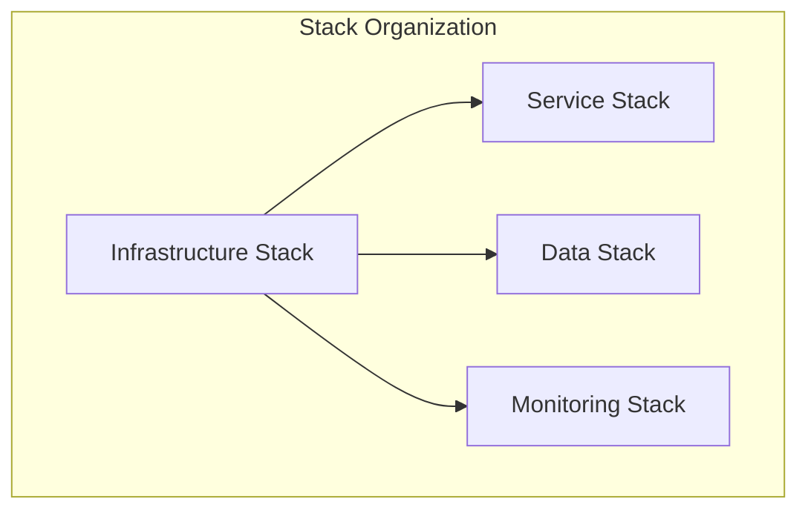
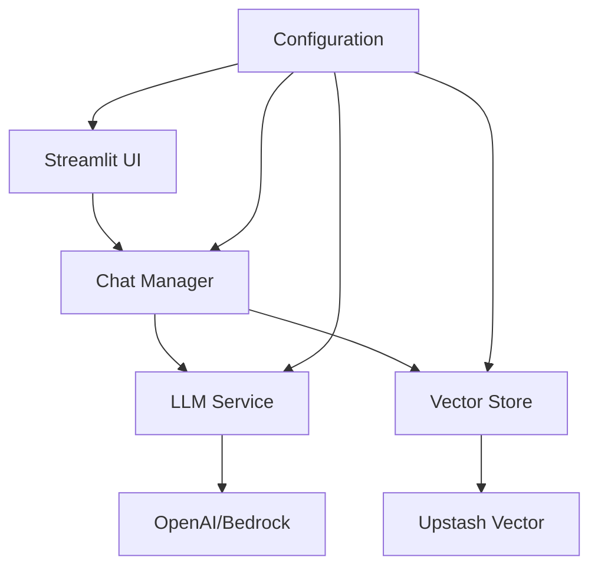
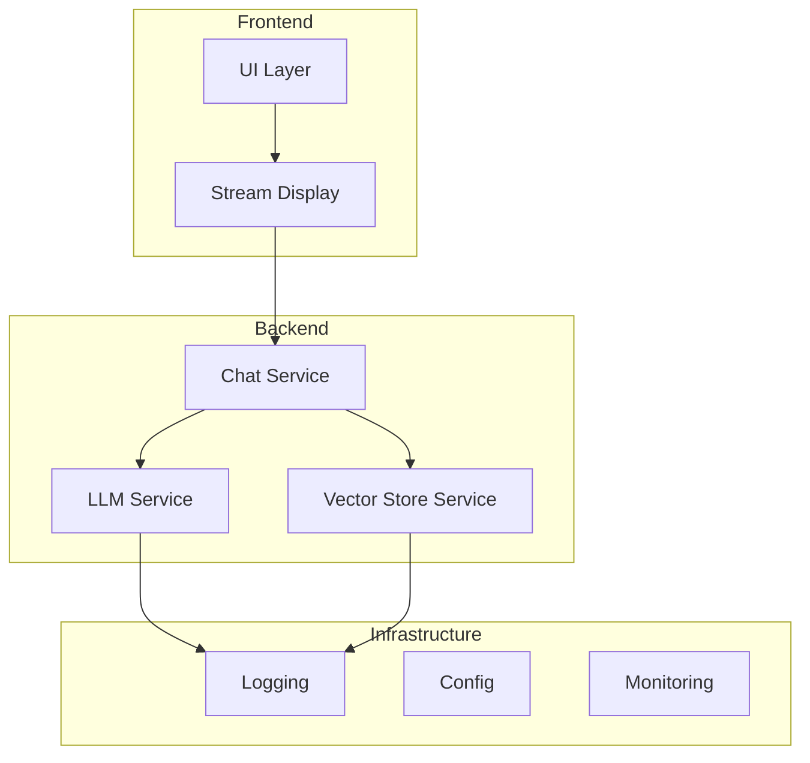
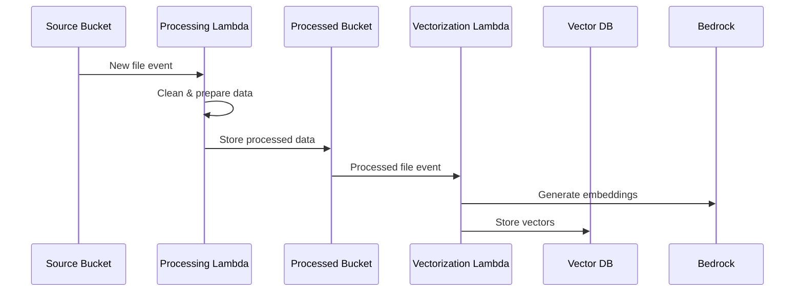
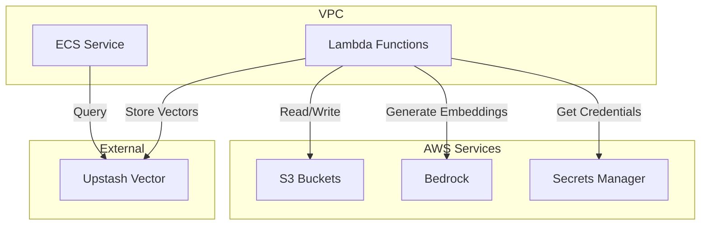

# LoreChat System Patterns

## Stack Organization

## Core Architecture

### System Overview

### Key Components

## Core Design Patterns

### 1. Service Layer
- Abstract interfaces for LLM with factory-based instantiation
- Factory-based vector store implementation with external Vector DB
- Streaming response handling
- Data processing pipeline with Lambda functions

### 2. Data Flow

### 3. Data Processing Pipeline

### 4. Key Patterns
- Configuration management with Pydantic
- Dependency injection for services
- Repository pattern for vector store
- Error handling and recovery
- State management (session-based)
- Event-driven data processing
- Secure credential management

## Infrastructure

### AWS Integration

### Development
- Docker-based local environment
- Hot reloading enabled
- Comprehensive testing setup
- Monitoring and logging
- Lambda function development
- Data pipeline testing

### Security
- Environment-based configuration
- Secret management
- Input validation
- Resource limits
- AWS IAM integration
- S3 bucket policies
- Lambda execution roles
