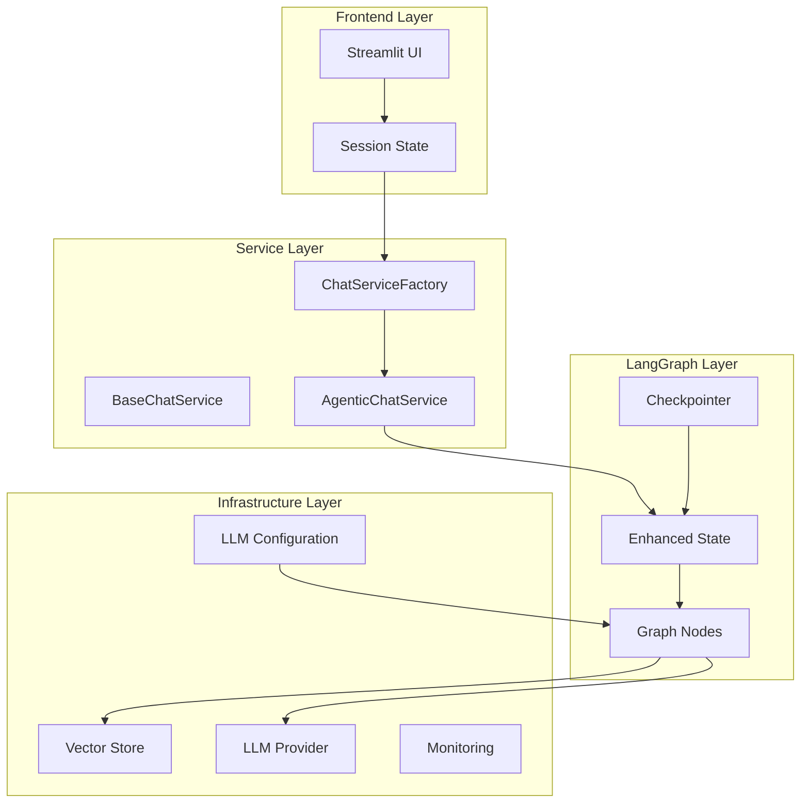
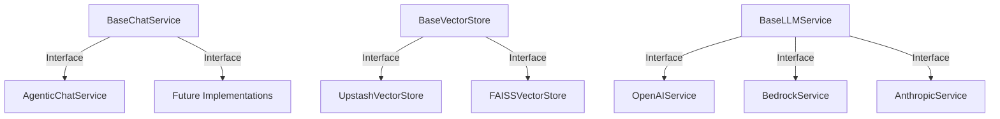
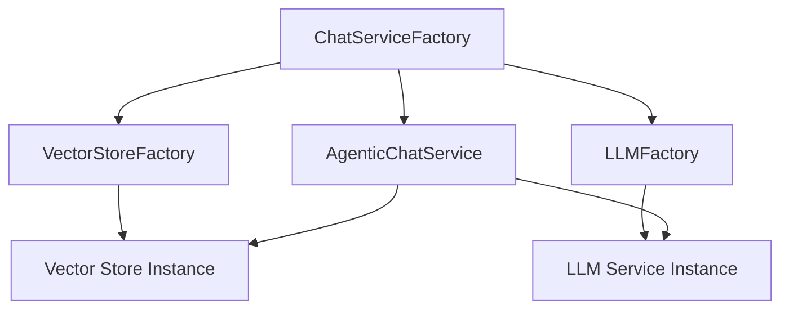
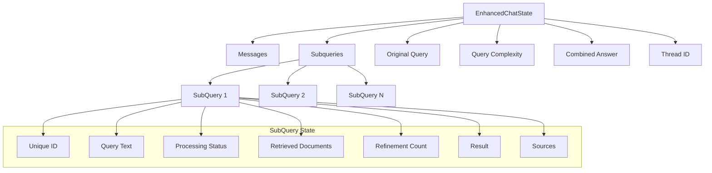
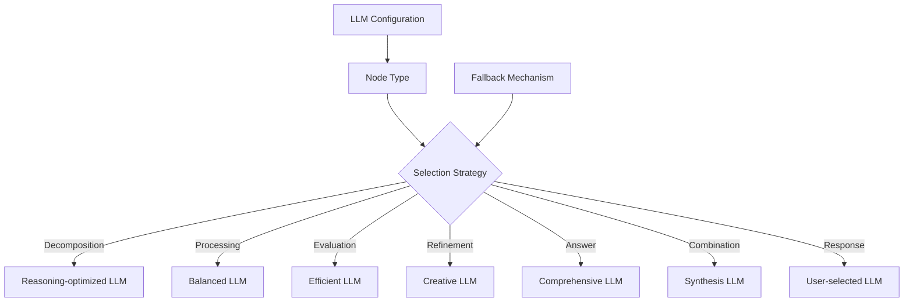
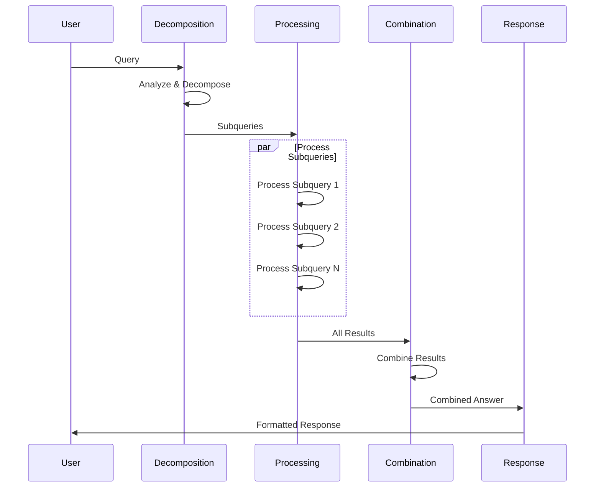
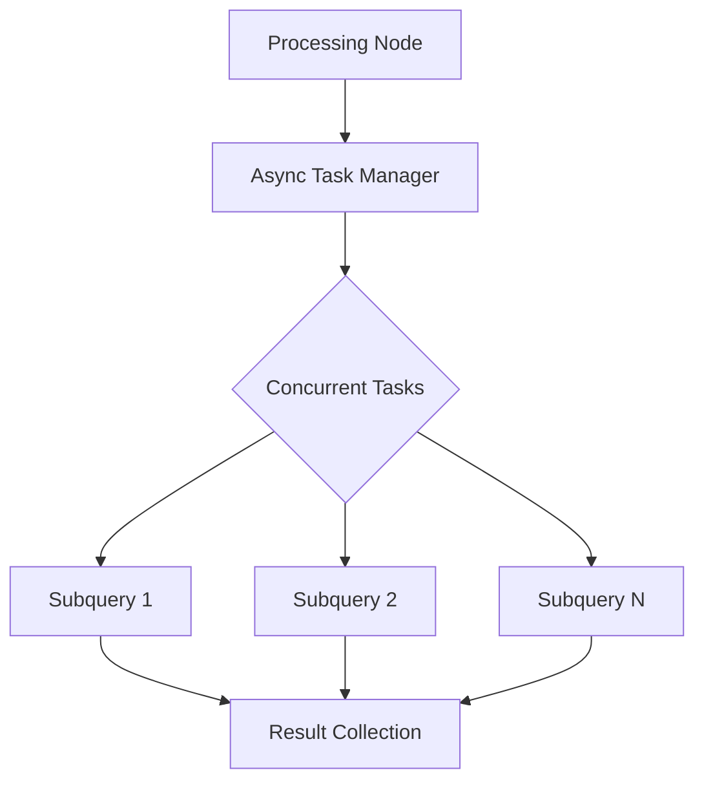

# LoreChat System Patterns

## Architectural Layers

## Core Design Patterns

### 1. Interface Segregation Pattern

The system uses clear interface boundaries to separate concerns and enable flexible implementations:

**Key Benefits**:
- Decouples implementation from interface
- Enables runtime provider swapping
- Simplifies testing with mock implementations
- Provides clear contract boundaries

### 2. Factory Pattern

Factories handle the complexity of object creation and dependency management:

**Key Benefits**:
- Centralizes creation logic
- Handles dependency injection
- Abstracts infrastructure details
- Simplifies client code

### 3. Enhanced State Management Pattern

The system uses a rich state model that extends LangGraph's base state:

**Key Benefits**:
- Explicit state tracking
- Comprehensive error handling
- Clear state transitions
- Support for complex workflows

### 4. Strategy Pattern for LLM Selection

The system dynamically selects appropriate LLMs for different reasoning tasks:

**Key Benefits**:
- Optimized model selection
- Cost-performance balance
- Specialized reasoning capabilities
- Graceful fallback mechanisms

### 5. Agentic Workflow Pattern

The system implements a sophisticated graph-based workflow for query processing:

**Key Benefits**:
- Clear reasoning paths
- Parallel processing capabilities
- Explicit state transitions
- Comprehensive error handling

## Architectural Decisions

### 1. Node Responsibility Separation

Each node in the graph has a single, well-defined responsibility:

| Node | Responsibility | Design Pattern |
|------|----------------|----------------|
| Decomposition | Query analysis and breakdown | Strategy Pattern |
| Processing | Parallel subquery handling | Observer Pattern |
| Combination | Result synthesis | Composite Pattern |
| Response | Final formatting | Template Method |

**Rationale**: Clear separation of concerns enables focused testing, easier maintenance, and better error isolation.

### 2. Asynchronous Processing

The system uses asyncio for concurrent subquery processing:

**Rationale**: Parallel processing significantly reduces response time for complex queries while maintaining thread safety.

### 3. Specialized LLM Selection

Different reasoning tasks use different LLM models based on their strengths:

| Task | Model Characteristics | Rationale |
|------|----------------------|-----------|
| Decomposition | Strong reasoning | Complex analysis requires sophisticated reasoning |
| Evaluation | Fast, efficient | Quick assessment of document relevance |
| Refinement | Creative, flexible | Query reformulation benefits from creative thinking |
| Answer | Comprehensive | Detailed answer generation needs thorough understanding |
| Combination | Synthesis ability | Combining multiple perspectives requires synthesis skills |

**Rationale**: Matching model capabilities to task requirements optimizes both cost and performance.

## Development Guidelines

### Service Layer Design

1. **Interface First**
   - Define clear service interfaces before implementation
   - Use abstract base classes for common functionality
   - Follow dependency injection principles
   - Design for testability

2. **Factory Implementation**
   - Centralize creation logic in factories
   - Handle dependencies internally
   - Provide simple creation methods
   - Abstract infrastructure details

3. **Provider Abstraction**
   - Create provider-agnostic interfaces
   - Implement provider-specific adapters
   - Enable runtime provider swapping
   - Handle provider-specific error cases

### Graph Layer Design

1. **State Management**
   - Define explicit state schema
   - Use typed state objects
   - Track processing status comprehensively
   - Handle state transitions atomically

2. **Node Implementation**
   - Focus each node on a single responsibility
   - Implement parallel processing where appropriate
   - Use specialized LLMs for different tasks
   - Handle errors gracefully with fallbacks

3. **Error Handling**
   - Implement node-specific error handling
   - Provide graceful degradation paths
   - Preserve partial results when possible
   - Enable comprehensive error reporting

### Testing Approach

1. **Unit Testing**
   - Test each node in isolation
   - Validate state transitions
   - Check error handling paths
   - Mock dependencies for focused testing

2. **Integration Testing**
   - Test node interactions
   - Validate workflow paths
   - Check error propagation
   - Monitor performance metrics

3. **System Testing**
   - Test end-to-end workflows
   - Validate streaming behavior
   - Check thread persistence
   - Verify specialized LLM selection
