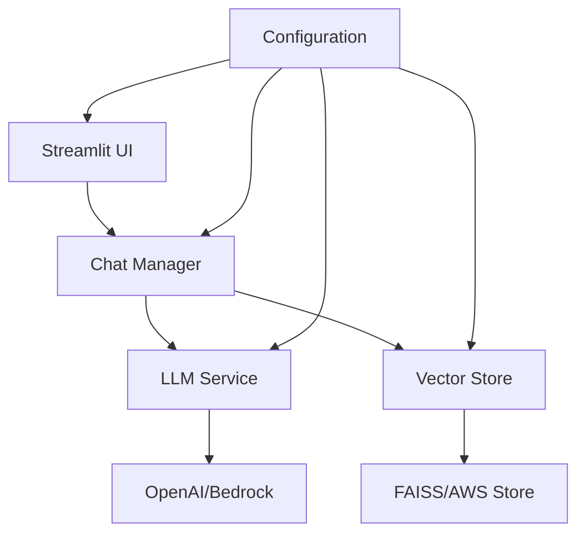
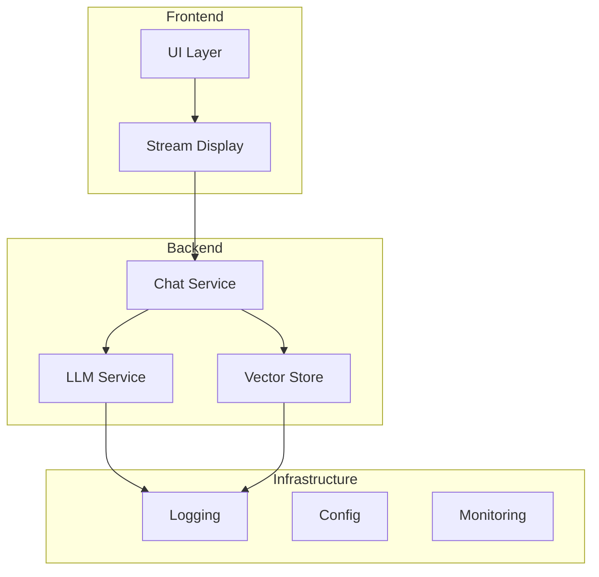
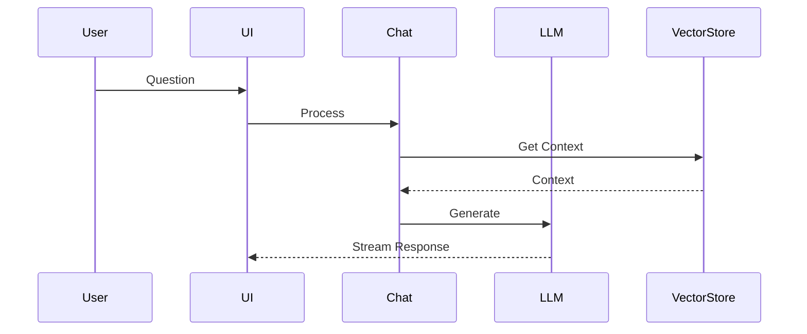
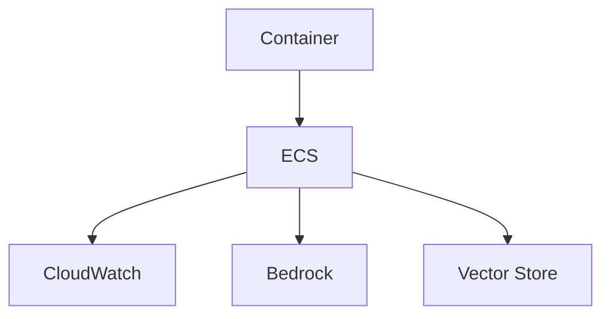

# SiteChat System Patterns

## Core Architecture

### System Overview

### Key Components

## Core Design Patterns

### 1. Service Layer
- Abstract interfaces for LLM and vector store
- Provider-agnostic implementations
- Factory-based service instantiation
- Streaming response handling

### 2. Data Flow

### 3. Key Patterns
- Configuration management with Pydantic
- Dependency injection for services
- Repository pattern for vector store
- Error handling and recovery
- State management (session-based)

## Infrastructure

### AWS Integration

### Development
- Docker-based local environment
- Hot reloading enabled
- Comprehensive testing setup
- Monitoring and logging

### Security
- Environment-based configuration
- Secret management
- Input validation
- Resource limits
- AWS IAM integration
