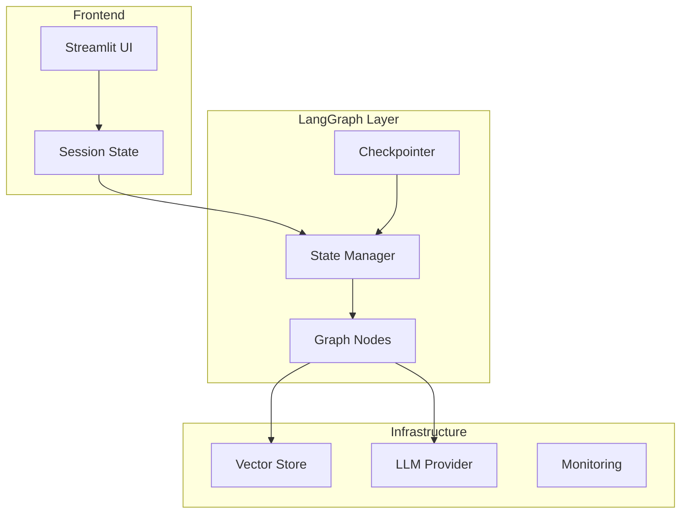
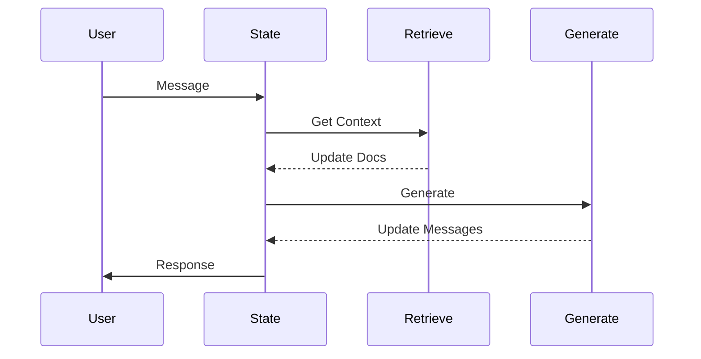
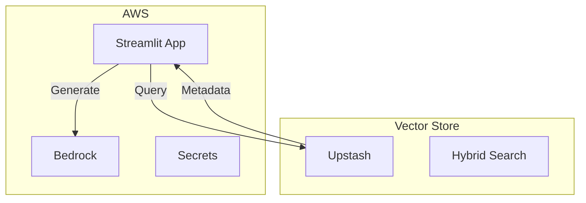

# LoreChat System Patterns

## Core Architecture



## Key Design Patterns

### 1. Graph State
```python
class ChatState(MessagesState):
    messages: List[BaseMessage]
    retrieved_docs: List[Document]
```

### 2. Node Implementation
```python
def retrieve_context(state: ChatState):
    """Get relevant docs from vector store."""
    docs = vector_store.get_relevant_documents(
        state["messages"][-1].content
    )
    return {"retrieved_docs": docs}

def generate_response(state: ChatState):
    """Generate response with sources."""
    sources = [doc.metadata["url"] for doc in state["retrieved_docs"]]
    response = llm.invoke(format_prompt(state))
    return {"messages": [AIMessage(content=response + "\n\nSources: " + sources)]}
```

### 3. Graph Workflow


## Infrastructure

### Service Integration


## Development Guidelines

### Graph Development
1. State Management
   - Define clear state schema
   - Use typed state classes
   - Handle state updates atomically

2. Node Design
   - Pure functions for nodes
   - Clear input/output contracts
   - Handle errors gracefully

3. Checkpointing
   - Use thread IDs for sessions
   - Implement state persistence
   - Handle recovery cases

### Testing Strategy
1. Node Testing
   - Test state transitions
   - Validate metadata handling
   - Check error cases

2. Graph Testing
   - Test workflow paths
   - Validate checkpointing
   - Monitor performance

3. Integration Testing
   - Test source attribution
   - Validate thread persistence
   - Check streaming behavior
