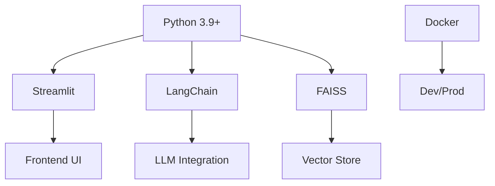
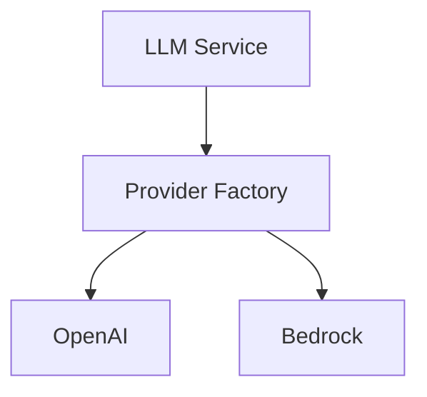
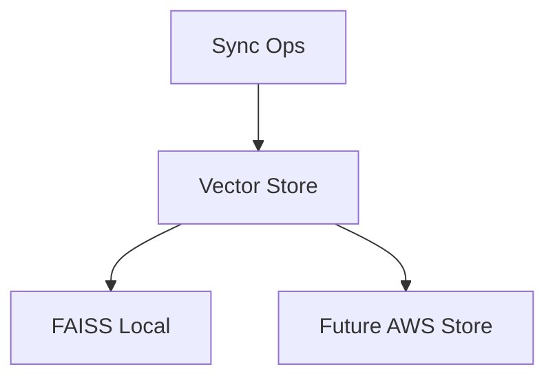

# SiteChat Technical Context

## Technology Stack

### Core Technologies

### Key Dependencies
- Streamlit >= 1.32.0
- LangChain >= 0.1.0
- FAISS-CPU >= 1.7.4
- Pydantic >= 2.0.0
- Boto3 >= 1.34.0

### Development Tools
- Docker, Docker Compose
- Git, AWS CLI
- VSCode (recommended)

## Development Environment

### Local Setup
- Python 3.9+, Docker, AWS CLI
- Directory structure: app/, docker/, tests/, vectorstore/, logs/
- Key env vars: ENV, DEBUG, LOG_LEVEL, LLM_PROVIDER, API keys, AWS settings

### Docker Configuration
- Dev: Streamlit port 8501, volume mounts for app, logs, vectorstore
- Prod: Python 3.9-slim, optimized, minimal deps, security-hardened

## Service Integration

### LLM Integration

### Vector Store

## Technical Constraints
- Performance: Memory limits, response times, concurrent users
- Security: API keys, env isolation, network security
- Development: Framework limits, Docker constraints, code quality

## Monitoring and Testing
- Logging: DEBUG to ERROR, file/console, rotation, structured
- Metrics: Response times, error rates, resource usage
- Health Checks: Container, service, dependencies
- Testing: Unit, integration, performance (pytest)

## Deployment
- Dev: docker-compose up --build (localhost:8501)
- Prod: AWS ECS, task definitions, scaling, load balancing

## Resource Management
- Container: Memory, CPU, storage, network
- Application: Vector store, logs, temp storage, caching

## Development Guidelines
- Standards: Flake8, type hints, docs, tests
- Practices: Error handling, logging, security, performance
- Workflow: Feature branches, code review, testing, documentation
