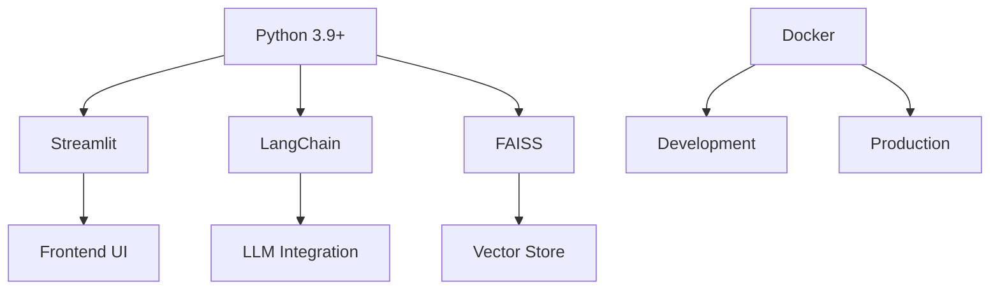
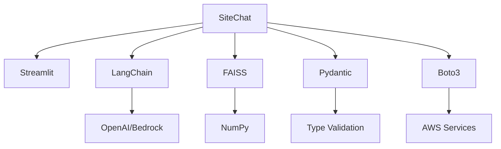
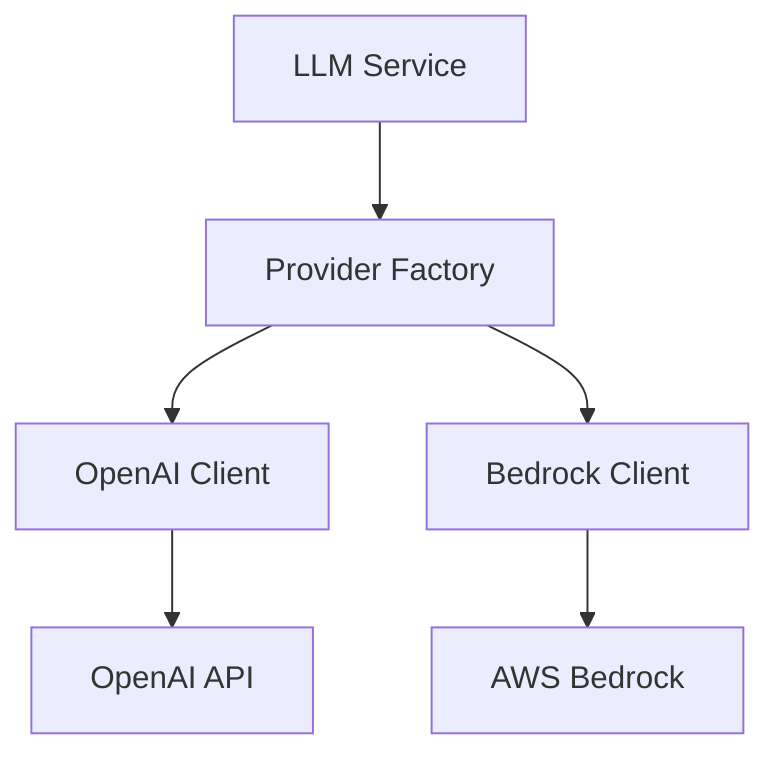
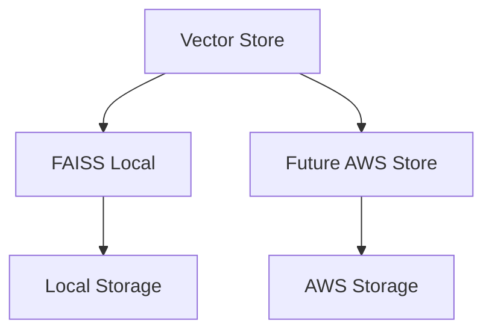

# SiteChat Technical Context

## Technology Stack

### Core Technologies


### Framework Versions
- Streamlit >= 1.32.0
- LangChain >= 0.1.0
- LangChain Community >= 0.0.16
- FAISS-CPU >= 1.7.4
- Pydantic >= 2.0.0
- Boto3 >= 1.34.0

### Development Tools
- Docker and Docker Compose
- Git version control
- AWS CLI
- Python virtual environments
- VSCode (recommended IDE)

## Development Environment

### Local Setup
1. **Prerequisites**
   ```bash
   # System requirements
   Python 3.9+
   Docker
   Docker Compose
   AWS CLI
   ```

2. **Environment Configuration**
   ```bash
   # Directory structure
   SiteChat/
   ├── app/           # Application code
   ├── docker/        # Docker configuration
   ├── tests/         # Test suites
   ├── vectorstore/   # Vector store data
   └── logs/          # Application logs
   ```

3. **Environment Variables**
   ```bash
   # Required variables
   ENV=development
   DEBUG=true
   LOG_LEVEL=INFO
   LLM_PROVIDER=bedrock  # or openai
   
   # OpenAI settings
   OPENAI_API_KEY=your_key_here
   OPENAI_MODEL=gpt-3.5-turbo
   
   # AWS settings
   AWS_DEFAULT_REGION=us-west-2
   AWS_BEDROCK_MODEL_ID=anthropic.claude-3-sonnet-20240229-v1:0
   ```

### Docker Configuration

#### Development Container
```yaml
# Key configurations
version: '3.8'
services:
  sitechat:
    build:
      context: ../..
      dockerfile: docker/dev/Dockerfile
    ports:
      - "8501:8501"
    volumes:
      - ../..:/app
      - sitechat_logs:/app/logs
      - sitechat_vectorstore:/app/vectorstore
```

#### Production Container
- Based on Python 3.9-slim
- Optimized for production use
- Minimal dependencies
- Security hardening

## Technical Dependencies

### Direct Dependencies


### Infrastructure Dependencies
- Docker runtime
- AWS credentials
- Network access
- Storage volumes

## Service Integration

### LLM Integration


### Vector Store Integration


## Technical Constraints

### Performance Constraints
- Memory usage limits
- Response time targets
- Concurrent user limits
- Container resource limits

### Security Constraints
- API key management
- Environment isolation
- Network security
- Data protection

### Development Constraints
- Framework limitations
- Docker constraints
- Testing requirements
- Code quality standards

## Monitoring and Logging

### Logging System
```python
# Logging configuration
- Log levels: DEBUG, INFO, WARNING, ERROR
- File and console output
- Rotation policy
- Structured logging
```

### Monitoring Metrics
- Response times
- Error rates
- Resource usage
- User interactions

### Health Checks
- Container health
- Service status
- Dependencies
- Resource availability

## Testing Infrastructure

### Test Types
1. **Unit Tests**
   - Service tests
   - Component tests
   - Utility tests

2. **Integration Tests**
   - API integration
   - Service interaction
   - End-to-end flows

3. **Performance Tests**
   - Load testing
   - Stress testing
   - Endurance testing

### Test Configuration
```python
# Test settings
pytest>=8.0.0
pytest-asyncio>=0.21.1
```

## Deployment Configuration

### Development Deployment
```bash
# Local deployment
docker-compose up --build

# Development URL
http://localhost:8501
```

### Production Deployment
- AWS ECS configuration
- Task definitions
- Service scaling
- Load balancing

## Resource Management

### Container Resources
- Memory allocation
- CPU limits
- Storage volumes
- Network configuration

### Application Resources
- Vector store size
- Log rotation
- Temporary storage
- Cache management

## Technical Roadmap

### Phase 1: Development Setup
- Environment configuration
- Docker setup
- Local testing
- Development tools

### Phase 2: Core Implementation
- Streamlit UI
- LLM integration
- Vector store setup
- Basic functionality

### Phase 3: Production Preparation
- Performance optimization
- Security hardening
- AWS integration
- Monitoring setup

## Development Guidelines

### Code Standards
- Flake8 compliance
- Type hints
- Documentation
- Testing requirements

### Best Practices
- Error handling
- Logging standards
- Security practices
- Performance optimization

### Development Workflow
- Feature branches
- Code review
- Testing process
- Documentation updates
