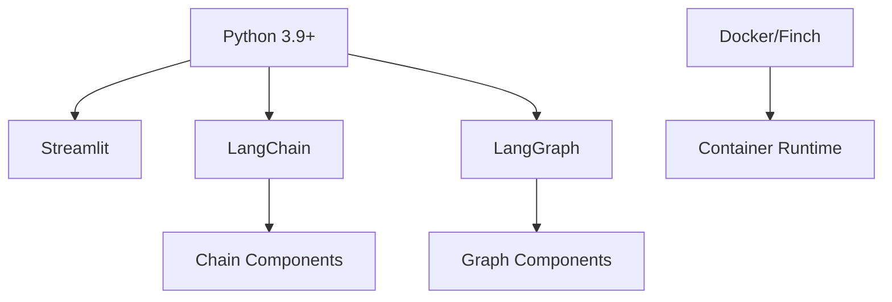
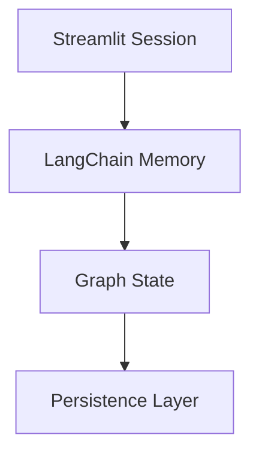
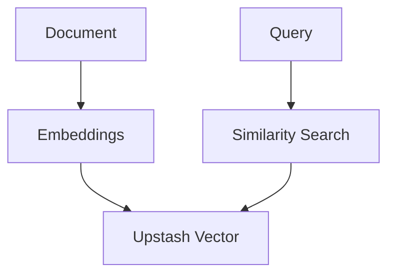

# LoreChat Technical Context

## Core Stack



## Key Dependencies
- Streamlit >= 1.32.0
- LangChain >= 0.1.0
- LangGraph >= 0.0.10
- Upstash Vector >= 0.8.0
- Pydantic >= 2.0.0

## Component Architecture

### LangChain Integration
```python
# Core abstractions
from langchain.llms.base import BaseLLM
from langchain.vectorstores.base import VectorStore
from langchain.memory import BaseMemory

# Chain composition
from langchain.chains import ConversationChain
from langchain.chains.retrieval_qa import RetrievalQA
```

### LangGraph Workflows
```python
from langgraph.graph import StateGraph
from typing import TypedDict, Annotated

# State management
class ChatState(TypedDict):
    messages: list[dict]
    context: list[Document]
    current_node: str
```

## Development Environment

### Local Setup
```bash
# Core dependencies
pip install langchain langgraph streamlit "upstash-vector[numpy]"

# Development tools
pip install pytest pytest-asyncio pytest-cov
```

### Container Configuration
- Base: python:3.9-slim
- Platform: linux/arm64
- Memory: 2GB limit
- Ports: 8501 (Streamlit)

## Service Integration

### Memory Management


### Vector Store Integration


## Technical Constraints

### Performance
- Response time: < 1s
- Memory per session: < 500MB
- Concurrent users: ~50
- Token limits: Varies by model

### Security
- API key management
- Session isolation
- Input validation
- Resource limits

### Development
- Type safety
- Error handling
- State validation
- Testing coverage

## Monitoring Strategy

### Key Metrics
- Chain execution times
- Graph state transitions
- Memory usage
- Error rates

### Logging
- Structured JSON
- Chain events
- Graph transitions
- Error tracking
