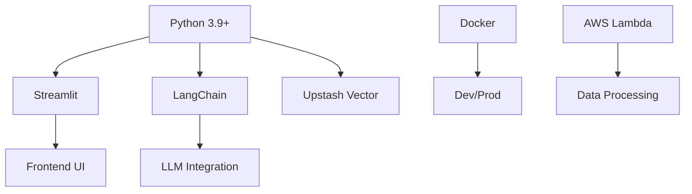
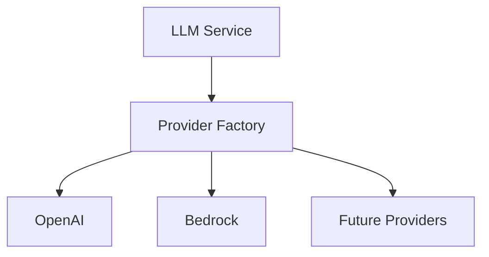
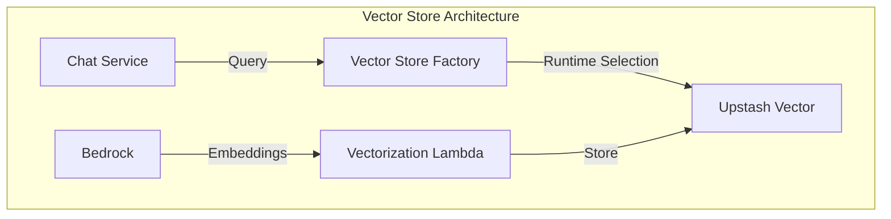
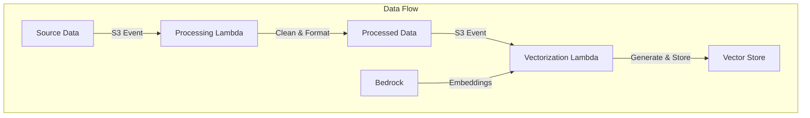

# LoreChat Technical Context

## Technology Stack

### Core Technologies

### Key Dependencies
- Streamlit >= 1.32.0
- LangChain >= 0.1.0
- Pydantic >= 2.0.0
- Boto3 >= 1.34.0
- UpstashVector >= 0.8.0

### Development Tools
- Docker, Docker Compose
- Git, AWS CLI
- VSCode (recommended)
- AWS SAM CLI (Lambda development)

## Development Environment

### Local Setup
- Python 3.9+, Docker, AWS CLI
- Directory structure: app/, docker/, tests/, lambda/, logs/
- Key env vars: ENV, DEBUG, LOG_LEVEL, LLM_PROVIDER, API keys, AWS settings, UPSTASH_* credentials

### Docker/Finch Configuration
- Dev: Streamlit port 8501, volume mounts for app, logs
- Prod: Python 3.9-slim, optimized, minimal deps, security-hardened
- Both environments support Finch as an alternative to Docker
- USE_FINCH build argument controls Finch usage
- Platform set to linux/arm64 for compatibility

## Service Integration

### LLM Integration

### Vector Store Integration

### Data Processing Pipeline

## Technical Constraints
- Performance: Memory limits, response times, concurrent users
- Security: API keys, env isolation, network security
- Development: Framework limits, Docker constraints, code quality
- LLM: Factory-based provider selection, API compatibility
- Vector Store: Upstash Vector integration, synchronous operations
- Lambda: Execution time limits, memory constraints, cold starts

## Monitoring and Testing
- Logging: DEBUG to ERROR, file/console, rotation, structured
- Metrics: Response times, error rates, resource usage
- Health Checks: Container, service, dependencies, Lambda functions
- Testing: Unit, integration, performance (pytest)
- Lambda Testing: Local invocation, event simulation

## Deployment
- Dev: docker-compose up --build (localhost:8501)
- Prod: AWS ECS, Lambda functions, task definitions, scaling
- Data Pipeline: Event-driven Lambda functions
- Vector Store: Upstash Vector cloud service

## Resource Management
- Container: Memory, CPU, storage, network
- Lambda: Memory allocation, timeout configuration
- Application: Vector store, logs, temp storage
- S3: Source data, processed data storage
- Upstash Vector: Vector storage and querying

## Development Guidelines
- Standards: Flake8, type hints, docs, tests
- Practices: Error handling, logging, security, performance
- Workflow: Feature branches, code review, testing, documentation
- Lambda Development: Local testing, event-driven design
- Data Processing: Validation, error handling, retries

## Security Considerations
- AWS IAM roles and policies
- Upstash Vector authentication
- S3 bucket policies
- Lambda execution roles
- Secret management
- Network security
- Data encryption
